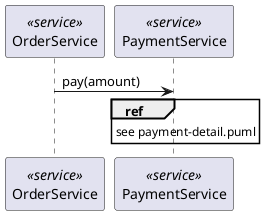

# Cross-diagram relationships in pumllint — boundaries, overlap, fit, gap, sense, nonsense

*Dated evaluation, 2026-08-28, written against `e989da8` (v0.29.0). The
question as posed: does pumllint support or lint relationships **between
different diagrams**? The asker's reading is that pumllint checks diagrams
that happen to sit in the same folder, but that there is no way to declare
the hierarchy and relationships **between** diagrams in a code format, the
way Linked.Archi does with an RDF qualified relationship — a direct triple,
a qualified predicate, and a first-class relationship resource carrying
`arch:source`, `arch:target`, `rdf:reifies`, provenance and an owner. Then:
grade the sense, nonsense, fit, gap and SWOT.*

**Verdict up front: the reading is correct, and it is sharper than stated.
pumllint has a cross-diagram layer — five XD rules building an entity symbol
table across the whole lint batch — but that layer joins *nodes* and never
*edges*. There is no relationship-between-diagrams concept anywhere in the
product: not in the parser, not in the model (`Diagram` has no field naming
another diagram), not in the rule framework, not in the report shapes, not in
the scoring. What exists is an **implicit, undeclared, name-equality join**:
two diagrams are "related" if and only if they happen to spell an entity the
same way, and the only thing checked is whether the facts they each assert
about that spelling agree. Nothing is declared, nothing is typed, nothing is
directed, and nothing is checked about the edges themselves. The nearest
shipped mechanism to a declared link is `pumllint trace`, which reads
requirement IDs out of prose directives — a bipartite, untyped, undirected
reference table, not a relationship graph.**

**Four measurements carry this note, all reproducible from §11.**

**(1) The join is on nodes, never edges.** Three diagrams whose entities
agree perfectly but whose *relationships* directly contradict each other —
`OrderService -> PaymentGateway` in one, `PaymentGateway -> OrderService` in
another, and a class model in which the dependency does not exist at all —
produce **zero cross-diagram findings**. The only finding is an unrelated
intra-diagram `CLS002`. This is the literal answer to the question asked.

**(2) The join key is the alias, and the display name is ignored.** Two
diagrams declaring `participant "Order Service" as OS <<service>>` and
`database "Order Service" as OrderService <<store>>` — the same entity by
every human reading, with a conflicting kind *and* a conflicting stereotype,
exactly what XD001 and XD002 exist to catch — produce **zero findings**,
because the symbol table is keyed on the canonical alias. Identity is
whatever the author typed after `as`.

**(3) `!include` — PlantUML's own cross-file composition mechanism, and the
only one teams actually use to share entity declarations — makes the XD pack
blind, and *raises* the maturity score.** The parser skips every line
starting with `!`, so an included declaration never lands in the model and
its participant becomes implicit; XD001/XD002 read only `declared` sites. The
same conflicting pair scores **72.5/100 with both declarations inline (DIM-CON
0, four XD findings) and 87.5/100 with one moved into an `!include` (DIM-CON
100, zero XD findings)** — **+15.0 points and a whole dimension, for the same
architecture, the same conflict and the same rendered picture.** On
28-element diagrams the same conflict moves the set 99.8 → 98.5, so the
signal is density-diluted as well as evadable.

**(4) `ref over` — PlantUML's one native construct for "this interaction is
elaborated in another diagram" — is not in the parsed model at all.** Not a
participant, not a message, not a block, not a directive: `ref over
PaymentService : see payment-detail.puml` is dropped whole. `SEQ006`'s own
remediation text recommends `ref over`; the linter recommends a construct it
cannot see, and it is the only construct in the notation that names another
diagram.

**And the fit is better than the gap suggests, in one specific direction:
half of what the question asks for is already recorded in the roadmap and
waiting on a trigger.** ROADMAP's open Arc C item *"XD member and relationship
coherence"* (recorded 2026-08-26 out of the J-F foreign-corpus audit) is
precisely the edge half of measurement (1) — extending the corpus-wide symbol
table from participant identity to **declared members and relationship
direction** — with a stated trigger (*a second corpus or an adopter showing
the same defect class*). This note supplies the reproducible probe that item
lacked, and argues its scope should be **within-notation edge coherence**,
never the RDF qualified-relationship shape. Nothing is queued here either.

---

## 0. Why this ran, and what it is not

This is the twelfth externally-prompted analysis run under the house
discipline and the second in the Linked.Archi thread. The first
([Linked.Archi and pumllint, evaluated](linked-archi-evaluation.md),
2026-08-27) asked whether the *ecosystem* was a build or dependency
candidate, and answered no. This one asks a narrower, product-facing
question that the first note did not answer: **what does pumllint actually do
about relationships between diagrams, and what would it take to do more?**

It is **not** a re-litigation of the 2026-08-26 knowledge-graph settlement or
the 2026-08-27 Linked.Archi settlement. Both stand and neither is disturbed;
§5 shows why the strongest version of the ask lands squarely inside the
knowledge-graph never-build list. It is also **not** a build proposal —
§9 recommends one documentation change (made, §10) and records the rest
against existing triggers.

*Bounds. Every pumllint claim below was executed against the working tree at
`e989da8` (v0.29.0) and the commands are quoted in §11 so they can be
re-run. Both suites were green before and after the one change this note
makes: `python tests/run_tests.py` → 475/475, `python -m pytest` → 592
passed. Linked.Archi claims are carried over from the 2026-08-27 note, which
states its own bound: its tooling was not executed, and its claims come from
its published documentation. Nothing here rests on observed Linked.Archi
behaviour.*

## 1. What "relationships between diagrams" could mean — four distinct asks

The RDF snippet in the question is not one capability, it is four stacked
ones. Separating them is most of the analysis, because pumllint's answer is
different for each.

```turtle
# 1. Direct triple — for traversal and analytics
ex:AppSvc1 am:serves ex:BizProc1 .

# 2. Qualified predicate — navigates from source to the relationship resource
ex:AppSvc1 am:qualifiedServes ex:qr-005 .

# 3. Qualified relationship resource — the first-class architectural object
ex:qr-005 a am:Serving ;
    arch:source ex:AppSvc1 ;
    arch:target ex:BizProc1 ;
    rdf:reifies <<( ex:AppSvc1 am:serves ex:BizProc1 )>> ;  # 4. RDF 1.2 bridge
    prov:wasDerivedFrom ex:diagramEdge-81 ;
    dcterms:description "Shown on Viewpoint A"@en ;
    arch:conceptOwner ex:teamAlpha .
```

| # | The ask | What it needs | pumllint today |
|---|---|---|---|
| **A. Stable cross-file identity** | `ex:AppSvc1` is the same thing wherever it appears | A namespaced identifier, not a display string | **Partial, implicit.** Name-equality on the alias (§2.1); no namespace, no aliasing, no declaration (§3.1, §3.2) |
| **B. A typed, directed edge** | `am:serves` with a source and a target | An edge vocabulary and per-edge endpoints | **Within one diagram only.** `Message`, `ClassRelation`, `UseCaseLink`, `StateTransition` all carry direction; none is compared across diagrams (§3.3) |
| **C. The edge as a first-class object** | `ex:qr-005 a am:Serving`, addressable, annotatable | Reification, an identifier per edge, a place to hang facts | **Absent.** No model type, no report slot (§3.5) |
| **D. Provenance and governance on the edge** | `prov:wasDerivedFrom`, `dcterms:description`, `arch:conceptOwner` | Per-edge metadata, resolvable to a source | **Diagram-level only, and prose-carried.** GEN006/GEN007 read owner and requirement tags out of title/header/footer/caption/notes, per *diagram*, never per edge (§2.3) |

The question's framing — "it is not possible to define the hierarchy and
relationship between different diagrams in a code format" — targets **A + B
+ C**. §2 shows exactly how much of A ships; §3 measures that B and C do
not.

## 2. What pumllint ships today, measured

### 2.1 The XD pack: five rules, one symbol table, node identity only

Five of 51 catalog rules (**9.8%**) are cross-diagram. All five are tagged
`DIM-CON`, which carries composite weight **0.15** and holds 11 rules in
total (SCORING.md §2). They activate only when more than one diagram is
linted, and each needs at least two diagrams matching its `applies_to`
(`Engine._cross_violations`, SCORING.md §6).

| ID | Severity | Scope | Compares |
|---|---|---|---|
| XD001 | major | sequence | declaration kind of the same participant name |
| XD002 | minor | sequence | stereotype of the same participant name |
| XD003 | minor | sequence | spellings that differ only by case |
| XD004 | minor | all types | spellings that differ only by case, across diagram *types* |
| XD005 | minor | all types | stereotype, across diagram *types* |

The universe they walk is `_entity_sites()` in
`pumllint/rules/common/consistency.py`: sequence and use-case participants,
class classifiers, and activity swimlanes. State names are excluded on
purpose (states are modes of an entity, not entities).

Positive control — the pack works, and works well, at what it does:

```
a.puml:2: [XD001/major] Participant 'OrderService' is declared 'participant' here and the set
  disagrees ('participant' ×1, 'queue' ×1) — one entity, one kind
a.puml:2: [XD002/minor] Participant 'OrderService' is stereotyped <<service>> here and the set
  disagrees (<<gateway>> ×1, <<service>> ×1) — one entity, one stereotype
a.puml:2: [XD005/minor] Participant 'OrderService' is stereotyped <<service>> here and the set
  disagrees across diagram types (<<component>> ×1, <<gateway>> ×1, <<service>> ×1) …
b.puml:3: [XD003/minor] Participant 'ledger' collides case-insensitively with 'Ledger'
  (…/a.puml:3) — likely the same entity spelled differently
```

Note what every one of those messages is *about*: a **node**, and a
**property of that node** (kind, stereotype, spelling). Not one is about a
relationship.

### 2.2 The join is implicit, and that is a design choice with consequences

Two diagrams are "related", for XD purposes, when they use the same string as
an entity name. Nothing declares the relation; it is inferred from
coincidence of spelling. This is cheap, needs no new syntax, and works
without any authoring convention — genuinely the right default for a linter
whose whole thesis is that the artefact is a drawing, not a model.

It also means the relation is **unnamed, untyped, undirected, unowned and
undeclarable**. There is nowhere to say *"this checkout sequence refines that
context diagram"*, *"this class model is the structure behind that
interaction"*, or *"this entity here and that entity there are deliberately
different things"* (§3.4). The linter cannot distinguish a portfolio from a
pile.

### 2.3 `trace`: the one shipped cross-artifact mechanism, and its shape

`pumllint trace` builds a coverage matrix between a requirement inventory and
the diagrams that reference those IDs, reading IDs out of exactly the
carriers GEN007 checks — the `@startuml` name plus title/header/footer/
caption/notes (`prose_directives`, one carrier set so the rule and the matrix
cannot disagree).

It can be bent into a diagram→diagram link table by making diagram IDs the
"requirement" vocabulary — and the result is instructive:

```
Requirement coverage: 2/3 covered — 1 uncovered, 1 unlinked diagram(s) — across 3 diagram(s)

DGM-001  ← checkout.puml [checkout]:2, ctx.puml [ctx]:2
DGM-002  ← checkout.puml [checkout]:2
DGM-003  ✖ uncovered

Unlinked diagrams (no requirement reference):
  orphan.puml [orphan] (sequence)
```

`ctx.puml` **is** DGM-001. `checkout.puml` **refines** DGM-001. Both appear
in the same row as undifferentiated references. The relation type — the whole
point of `a am:Serving` and `arch:source`/`arch:target` in the question's
snippet — is not merely unmodelled, it is *collapsed*: identity and
refinement produce the same edge.

What `trace` does give, and the lint side does not, is **orphan detection**
(`orphan.puml` is named as unlinked) and CI gates for it
(`--fail-on-uncovered`, `--fail-on-unlinked`, `--fail-on-unknown-ref`). That
is the shape any future cross-diagram link checking should copy.

## 3. Gap — six measured findings

### 3.1 G1. Edges are never compared across diagrams *(the headline)*

Three diagrams with perfectly agreeing entities and mutually contradictory
relationships:

```plantuml
' one.puml     OrderService -> PaymentGateway: authorize(amount)
' two.puml     PaymentGateway -> OrderService: settle(id)
' three.puml   class model in which the dependency does not exist at all
```

```
three.puml:6: [CLS002/major] Association between 'OrderService' and 'Unrelated' has no
  multiplicity on 'OrderService' — …
✖ 1 issue(s): 1 major     exit=0
```

Zero cross-diagram findings. The one finding is intra-diagram and unrelated.
The batch model has no place to notice that a directed edge asserted in one
diagram is reversed in the next and denied in the third.

This is not an oversight in the rules — it is structural. `_entity_sites()`
yields participants, classifiers and swimlanes. `Message`, `ClassRelation`,
`UseCaseLink` and `StateTransition` are never enumerated across the batch by
anything.

### 3.2 G2. Identity is alias-equality; the display name is ignored

```plantuml
' one.puml   participant "Order Service" as OS <<service>>
' two.puml   database    "Order Service" as OrderService <<store>>
```

```
✔ No issues found.
```

A kind conflict *and* a stereotype conflict on what is unambiguously one
entity, silent — because `OS` ≠ `OrderService`. `Participant.display_name`
is parsed and stored, and no cross-diagram rule reads it. The corollary is
worse than the false negative: **an author can silence any XD finding by
renaming an alias**, which is a rename that changes nothing a reader sees.

### 3.3 G3. `!include` makes the XD pack blind — and *raises* the score

The parser skips every preprocessor line (`_iter_logical_lines`,
`pumllint/parser/sequence.py:175`), so a participant whose declaration lives
in an included file arrives as **implicit**, and XD001/XD002 read only
`p.declared` sites.

The same conflicting pair, differing only in where one declaration lives:

| | declarations inline | one declaration `!include`d |
|---|---|---|
| XD findings | 4 (XD001 ×2, XD002 ×2) | **0** |
| DIM-CON | **0** | **100** |
| score, both diagrams | **72.5/100** | **87.5/100** |

**+15.0 points and a whole dimension for a refactor that changes nothing but
which file a line sits in.** This is the sharpest instance in the repository
record of a *silencing mechanism* — the class the D2 and Ilograph notes have
been accumulating — and it is the first one that is not a mistyping artefact
but a straightforward consequence of the preprocessor skip meeting the
`declared` predicate.

Two aggravations worth stating plainly:

- The `.iuml` file itself is **collected** (`.iuml` is in `PUML_EXTENSIONS`)
  and yields **zero diagrams**, because it has no `@startuml`. Its content is
  never linted by anything, from either direction.
- Setting `SEQ001.only_if_any_declared = false` to compensate does not
  recover the XD signal; it converts the same file into **two `SEQ001`
  critical false positives** on participants that *are* declared, one file
  over.

Scale note, so this is not overstated: on 28-element diagrams the same
conflict is worth 99.8 → 98.5 (**−1.3**, no level change). The cross-diagram
signal is density-normalised like everything else, so it bites hardest on
small diagrams and fades on realistic ones.

### 3.4 G4. No namespace — and therefore no way to say "deliberately different"

Two bounded contexts, one word, two genuinely different entities:

```
manufacturing.puml:3: [XD005/minor] Class 'Order' is stereotyped <<work-order>> here and the set
  disagrees across diagram types (<<aggregate>> ×1, <<work-order>> ×1) — one entity, one stereotype
sales.puml:3:         [XD005/minor] Class 'Order' is stereotyped <<aggregate>> here and the set
  disagrees across diagram types (<<aggregate>> ×1, <<work-order>> ×1) — one entity, one stereotype
```

Correct behaviour under the rule as specified, and a false positive against
the model. The `authoritative` option cannot express this: it pins *one*
value per name, so using it here would declare one of the two contexts
wrong. The available escapes are renaming, per-line suppression, or disabling
XD005 — all of which cost real signal elsewhere. **Identity without
namespacing has no negative form: you can assert that two things are the
same, never that they are different.**

### 3.5 G5. Nothing in the model, the schemas or the CLI has a slot for a relation

- `pumllint/model.py`: `Diagram` carries `file_path`, `name`, line span,
  type, and per-type element collections. No field names another diagram.
- `pumllint/parser/sequence.py` reads exactly one file (`read_text_file`) and
  follows no reference out of it.
- `score.schema.json` → `modelSet` carries `level`, `levelName`, `score`,
  `diagramCount`, `elementCount`, `suppressedCount`, `baseline`. A model set
  is a **bag of independently scored diagrams plus an element-weighted
  average** — there is no connectivity term, and no slot an edge could
  occupy without a schema change. Report shapes are a stated contract
  (CLAUDE.md), so this is a deliberate boundary, not an omission.

### 3.6 G6. `ref over` is dropped, and the linter recommends it



Parsed model: `participants: ['OrderService', 'PaymentService']`,
`messages: [(OrderService, PaymentService, 'pay(amount)')]`, `blocks: []`,
`directives: [('title', 'Checkout')]`. The `ref over` line is gone.

`SEQ006`'s message reads *"Self-message on 'X' — consider a note or 'ref
over' instead"*. The tool recommends the notation's only cross-diagram
reference construct and has no model slot for it. If any single parser
change would be the cheapest foothold for declared cross-diagram links, it is
this one — the construct already exists, is idiomatic, is already recommended
by the catalog, and needs no invented convention (the C4 "externally-authored
convention" argument, not the glossary "convention-manufacturing" one).

## 4. Sense — four things the question gets right

**S1. The diagnosis is correct, and correct for the right reason.** "Diagrams
in the same folder get checked, but you cannot declare the hierarchy" is an
accurate description of the batch model: `collect_files` walks paths,
`lint_diagrams_grouped` scores each unit, and the XD pack joins whatever
names coincide. Folder membership *is* the relation.

**S2. Making the relationship a first-class object is genuinely the right
move — for a repository.** The question's snippet is not academic: an edge
you can address is an edge you can own (`arch:conceptOwner`), date, describe,
and trace to the diagram it came from (`prov:wasDerivedFrom
ex:diagramEdge-81`). Every one of those is a real governance need that a
per-diagram tag cannot serve, and pumllint's own GEN006/GEN007 prove the need
exists at the diagram level.

**S3. The gap named is already half-recorded, independently.** ROADMAP Arc C
carries an open, unqueued item — **"XD member and relationship coherence"** —
recorded 2026-08-26 after the J-F foreign-corpus audit found two defects that
were text-visible and survived a Level 5 100/100 gate: an asymmetric
dividend/sink pair, and a `..>` dependency pointing the wrong way. That is
G1 arrived at from a real corpus rather than from a probe. The question and
the audit converge on the same gap from opposite directions, which is the
strongest evidence in this note that the gap is real.

**S4. The hierarchy problem is the one pumllint's own evidence base points
at.** The measured thesis is that maturity predicts code-generation outcomes.
A generator handed a context diagram and a refinement of it has no way to
know which is which — and the repository has already measured what happens
when a model supplies content a diagram does not contain (−6 pp pooled
executed correctness on the agent-repair wave). Undeclared hierarchy is an
invitation to exactly that inference.

## 5. Nonsense — five moves to refuse

**N1. RDF/OWL/SHACL as the substrate. Refused, twice settled.** This is the
2026-08-26 knowledge-graph settlement's N1 and N3 verbatim: a triple store on
the product path fails the zero-dependency working agreement, and SHACL's
binary conformance over a tolerant projection cannot reach the graded-defect
class this catalog exists for. The 2026-08-27 Linked.Archi note observed the
same closed-world-over-a-projection hazard in a second, independently built
pipeline. Nothing in this question is new evidence against either.

**N2. Reification (asks C and D) inside `.puml` files. Refused on carrier
grounds.** Expressing `ex:qr-005 a am:Serving ; arch:source … ; arch:target
…` in PlantUML means smuggling a triple store through comments. It is
invisible to every renderer, unvalidated by PlantUML itself, and manufactures
a convention no ecosystem shares — the exact shape the 2026-08-02 settlement
refused for the glossary rule. If a project genuinely needs qualified
relationships, **the correct answer is Linked.Archi, and pumllint's job is to
gate the source file before the converter runs** — which is the shipped,
zero-code fit the 2026-08-27 note already recorded.

**N3. Inferring hierarchy from filenames, folders or heuristics. Refused on
the invention argument.** `01-context.puml` / `02-container.puml` is a naming
habit, not a declaration. A rule that guesses a parent and then reports
findings against the guess puts *invention* upstream of the gate whose
measured purpose is to catch invention. Any cross-diagram relation must be
**declared by the author or not exist**.

**N4. A cross-diagram "completeness" rule — every entity must appear in ≥2
diagrams, every use case must have a realizing sequence. Refused on the
oracle.** There is no defensible threshold. A context diagram legitimately
names services no interaction elaborates; a spike diagram legitimately stands
alone. Measured: a fully disconnected three-diagram portfolio with zero
shared entities lints clean at exit 0 — and that is **correct**, not a gap.
Silence on a disconnected portfolio is the honest verdict when nothing was
declared.

**N5. Following `!include` in the parser to fix G3. Refused as scoped here,
and this is the one refusal that may not last.** It is tempting and it is
wrong in this form: include resolution brings path semantics, `!includeurl`
(a network fetch from a linter that makes no network calls), `!define`/
`!function` macro expansion, include cycles, and a security surface the
config-trust boundary in SECURITY.md was written to avoid. G3 is real and its
*honest* fix is smaller than include resolution — see O2 in §7.

## 6. SWOT

**Strengths**

- The cross-diagram layer exists, is tested (`tests/test_crossfile.py`,
  BDD features XD001–XD005), is scored, and is specified in RULES.md. Most
  linters in this space have nothing across files at all.
- The symmetric-evidence design (issue #36) is right and unusual: no
  majority vote, every conflicted site reported, an `authoritative` pin for
  resolution. Drift that has spread does not indict the sites that stayed
  correct.
- `trace` already ships the *shape* a link checker needs — a declared
  inventory, prose carriers shared with a rule, both directions plus a
  dangling third, and CI gates.
- The measured cost of the whole cross-diagram join is ~3.0 ms over the
  174-diagram / 950-element wild corpus (knowledge-graph note, 2026-08-26).
  Scale is not the constraint on anything proposed here.

**Weaknesses**

- Nodes only, never edges (G1) — the literal subject of the question.
- Identity is alias-equality, defeated by an alias rename (G2) and by an
  `!include` (G3), the latter worth **+15.0 score points**.
- No namespace, so no way to declare two same-named things distinct (G4).
- The notation's own cross-diagram construct is dropped (G6).
- 5 of 51 rules, all in a 0.15-weight dimension, density-diluted to −1.3
  points on a realistic diagram: even where the layer fires, it is a nudge.

**Opportunities**

- The recorded Arc C item (S3) is a genuine, bounded, in-notation build with
  corpus evidence behind it and a stated trigger.
- G6 is the cheapest possible foothold for *declared* links: parse `ref
  over`, hold it in the model, and a diagram can name another diagram using
  syntax PlantUML already renders and the catalog already recommends.
- G3's fix (O2) is small, defensible and improves scoring honesty
  independently of anything cross-diagram.

**Threats**

- **Scope creep into model-repository territory.** Every step past
  in-notation edge coherence walks toward being a worse ArchiMate. The
  2026-08-27 ArchiMate settlement's core objection applies with full force:
  once the `.puml` stops being the source of truth, findings cannot be
  durably acted on.
- **False positives.** The J-F corpus measured **~73% false positives** on
  its own code-aware checks. Relationship-direction rules sit closest to
  relationship *legality*, which is the anti-goal named on 2026-08-02.
- **The evasions are cheap and silent.** G2 and G3 mean an adopter under
  gate pressure can clear XD findings by renaming an alias or moving a line —
  a ratchet that rewards evasion teaches evasion.

## 7. Options, graded

| | Option | Cost | Verdict |
|---|---|---|---|
| **O1** | **Do nothing; document the boundary.** Say plainly in README/RULES that the XD pack joins entity *identity* and does not compare relationships, and that the join is name-equality. | ~0 | **Recommended baseline.** The gap is currently discoverable only by reading `_entity_sites()`. |
| **O2** | **Close G3 honestly.** Do not resolve includes (N5). Instead make the *evasion* visible: when a sequence diagram contains preprocessor lines and declares nothing, say so — an existing precedent exists in the "nothing was checked" stderr warning, which warns without changing exit codes (CLAUDE.md contract). | small, no new deps, no report-shape change | **Recorded.** Best value per unit of risk; fixes a scoring-integrity defect independent of this question. |
| **O3** | **The recorded Arc C item: XD member and relationship coherence.** Compare *declared members* and *relationship direction* for entities the symbol table already joins. In-notation, no new syntax, no new carrier. | Arc C bar in full: mutation ladders, clean probes, additive golden re-freeze, pilot regeneration | **Already recorded, already triggered on an adopter or a second corpus.** This note adds the probe (§11, M3); it does not fire the trigger. |
| **O4** | **Declared links via `ref over` (G6) or a prose carrier.** Parse the construct, then either extend `trace` to diagram→diagram or add a link-integrity check (dangling target, orphan diagram) with `trace`-style gates. | medium; new model type, new report surface | **Recorded, adopter-triggered.** Convention is externally authored (PlantUML's own), which clears the bar the glossary rule failed. The prose-carrier variant is the same shape as the Linked.Archi note's recorded `'!la-` interop candidate — if either is ever built, build them together. |
| **O5** | **Qualified relationships (asks C+D): edge identity, typing, provenance, per-edge ownership.** | large; new syntax, new schema, a vocabulary to curate | **Refused (N1, N2).** This is Linked.Archi's job, it is done well there, and the shipped fit is `pumllint` in the producer repo before the converter. |

## 8. The honest summary for the asker

- **Does pumllint lint relationships between diagrams? No.** It lints
  *entity identity* across diagrams — five rules, one symbol table, node
  properties only. The edges are never compared (G1).
- **Can you declare hierarchy or relationships between diagrams in a code
  format? Not today.** The relation is inferred from spelling coincidence,
  and the two idioms that come closest — `!include` and `ref over` — are
  respectively invisible to the XD pack (G3) and absent from the model
  entirely (G6).
- **What is the nearest shipped thing?** `pumllint trace`: put an ID in the
  title or a note, keep an inventory file, and get a bipartite,
  **untyped and undirected** reference table with orphan detection and CI
  gates. It cannot tell "is" from "refines" (§2.3).
- **Should pumllint grow the RDF shape?** No — that is Linked.Archi's job,
  and the integration that pays already ships with no code on either side.
- **Should it grow *something*?** Yes, plausibly one bounded thing: the
  already-recorded XD relationship-coherence item, scoped to within-notation
  edge coherence, gated on an adopter. This note supplies its probe.

## 9. Recommendation

1. **Adopt O1 now** — this note is the documentation, indexed from
   `docs/README.md`. No product change.
2. **Record O2, O3, O4 against existing triggers.** O3 already exists in Arc
   C and keeps its trigger unchanged; this note is added as its reproducible
   probe. O2 and O4 are recorded here and in the ROADMAP, unqueued.
3. **Refuse O5 permanently**, on N1/N2 and the two standing settlements.
4. **Re-litigation triggers**, all about an adopter, none about whether the
   capability is desirable:
   - a project that keeps ≥2 diagram types describing the same system in one
     repo **and** shows a defect the XD pack missed because it compares nodes
     only (fires O3 — this would be the second corpus the Arc C item asks for);
   - a project whose `.puml` files use `!include` for shared declarations and
     whose maturity scores are consequently inflated (fires O2);
   - a project already running `pumllint trace` that asks for
     diagram→diagram links in the same table (fires O4);
   - **not** the existence of Linked.Archi, RDF 1.2, or any other ecosystem
     — settled 2026-08-26 and 2026-08-27.

## 10. One defect found and fixed

RULES.md's **XD pack preamble** still described the pre-v0.29.0 behaviour:

> *"For XD001/XD002/XD005 the **majority declaration wins** (ties resolve to
> the first-seen form): violations are attributed to the *minority* sites and
> reference an authoritative majority site, so a single outlier never indicts
> the conforming rest."*

Commit `9f06672` ("the XD pack reports every site and accepts an
authoritative pick", closing issue #36) removed majority voting entirely,
and updated the README table and the XD001/XD002/XD005 rule bodies — but not
the pack preamble two paragraphs above them. The preamble therefore
contradicted the code, the rule bodies below it, the README, and shipped
behaviour, as §2.1's positive control shows (both conflicting sites reported,
neither elected). Corrected in this change; both suites stay green.

## 11. Reproduction

All probes run from the repository root at `e989da8` with
`PYTHONPATH=$PWD`, against a config that switches off the repo's own
convention-gated GEN006/GEN007 so the cross-diagram signal is not buried:

```toml
# neutral.toml
[rules]
GEN006 = false
GEN007 = false
```

| Probe | What it establishes | Command |
|---|---|---|
| P1 | XD positive control — four findings on a kind/stereotype/case conflict | `pumllint -c neutral.toml p1/` |
| P2 | a child diagram may invent entities the parent lacks — silence | `pumllint -c neutral.toml p2/` |
| P4 | a fully disconnected portfolio is clean, exit 0 (correct, §5 N4) | `pumllint -c neutral.toml p4/` |
| **M3** | **contradictory edges over agreeing entities — zero XD findings (G1)** | `pumllint -c neutral.toml m3/` |
| **M2** | **same display name, different aliases, conflicting kind+stereotype — silent (G2)** | `pumllint -c neutral.toml m2/` |
| **P3d/e** | **`!include` silences XD001/XD002: 4 findings → 0 (G3)** | `pumllint -c neutral.toml p3e/` vs `p3d/` |
| **P3d/e** | **and moves the score 72.5 → 87.5, DIM-CON 0 → 100** | `pumllint score -c neutral.toml p3e/` vs `p3d/` |
| M4 | the same conflict on 28-element diagrams: 99.8 → 98.5, no level change | `pumllint score -c neutral.toml m4/` vs `m4clean/` |
| P7 | two bounded contexts, one word — a correct rule, a wrong verdict (G4) | `pumllint -c neutral.toml p7/` |
| P5 | `trace` bent into a diagram link table; "is" and "refines" collapse (§2.3) | `pumllint trace p5/ --requirements p5/inventory.txt --pattern 'DGM-\d+'` |
| G6 | `ref over` absent from the parsed model | `parse_file('caller.puml')` → `blocks: []`, `directives: [('title', …)]` |

Suites, before and after the §10 change:

```
python tests/run_tests.py   →  475/475 passed
python -m pytest            →  592 passed
```
