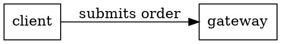

# The Graphviz / DOT ecosystem, evaluated — boundaries, overlap, fit, gap, sense, nonsense

*Dated evaluation, 2026-08-27, written against `73f8ed9` (v0.29.0). The
question as posed: investigate the Graphviz/DOT ecosystem, then assess the
boundaries, overlap, fit, gap, sense and nonsense of the different fits
against pumllint's roadmap and ecosystem. Tenth in a series
(Linked.Archi, C4, ArchiMate, BPMN, UML, Mermaid, D2, Structurizr DSL,
Ilograph, this).*

**Verdict up front: no, on four grounds — and one of them is unique in
the series: this is the first ecosystem the repository's own licence
posture forbids by name. Graphviz relicensed to **EPL 2.0 on 7 March
2026**, and the prose-pipeline settlement's never-build list reads *"EPL
dependencies anywhere in the repo (one GPL sdist — product and lab
alike)"*. Nothing is violated today — `pyproject.toml` declares
`dependencies = []`, no source file mentions Graphviz, and the optional
syntax gate only `subprocess`-invokes a user-configured command, which is
exactly the recorded run-not-linked analysis. But any Graphviz-based
approach — vendoring a layout, linking `pygraphviz` — lands on a
categorical house rule.**

**The other three. (2) DOT is not a diagram notation; it is a *graph*
language with layout attributes. **Zero of pumllint's five packs
transfer** — D2 at least had `shape: sequence_diagram`, and DOT has no
sequence concept whatsoever, no types, nothing but nodes, edges,
subgraphs and attributes. (3) Graphviz is not beside this project, it is
**underneath** it: for most of PlantUML's history `dot` *was* PlantUML's
layout engine, and since 1.2021.5 the pure-Java **Smetana** port makes it
optional (`!pragma layout smetana`). A dependency-of-the-renderer
relationship is unique across the ten. (4) The linting niche has been
**repeatedly attempted and nothing stuck** — `redot-lint` (described by
its own community in 2023 as "unfinished, unmaintained and tied to the
redot editor"), `graphviz-dot-hooks` pre-commit hooks, an attribute
checker, `gvpr` as a substrate, and forum threads literally titled
"Linter for the DOT language" and "A 'lint' program for Graphviz files".
Read correctly that is a signal *against*: people wanted it, built partial
things, and none took.**

**The measurement is the most nuanced of the series, and it is good news
with a caveat. Unlike D2 (Level 4, 99.17) and Ilograph YAML (Level 4,
99.62), **DOT wrapped in `@startuml` is mostly honest** — `unknown`, 0
elements, **Level 1 (Sketchy)**. But the reason is incidental, not
structural:**

| DOT form | Result |
|---|---|
| attributes + semicolons (idiomatic) | `unknown`, Level 1, 0 elements — **honest** |
| bare arrows + semicolons | `unknown`, Level 1, 0 elements — **honest** |
| bare arrows, **no semicolons** | `sequence`, Level 3, 89.0, 5 elements |
| undirected `--`, no semicolons | `sequence`, **Level 4, 91.0**, 5 elements |
| minimal one-liner `digraph { a -> b }` | `unknown`, Level 1 — honest |

**The semicolon is what saves it.** `a -> b;` fails the message pattern
on its trailing `;`; `a -> b` matches. Semicolons are **optional** in
DOT, so idiomatic files are protected by punctuation the language does
not require — and the undirected `--` form, already named in the ArchiMate
note as an unsafe token, reaches Level 4. The protection is real, and it
is luck.**

*Bounds. Every pumllint claim was executed at `73f8ed9` with default
config on files outside the repo (verified: GEN006/GEN007 stay dormant).
**No Graphviz tool was executed** — `dot` was not installed, so nothing
here reports what it accepts or how its own error messages read. Per this
session's repository scope **no GitHub repository was read**, which
matters here: `redot-lint`, `graphviz-dot-hooks` and `gvpr-lib` are all
GitHub-hosted, so their maintenance status and rule sets are
characterized from search summaries and forum discussion, not inspected.
The Graphviz licence and relicensing date are verified from
`graphviz.org/license/`; PlantUML's Smetana relationship is characterized
from plantuml.com and search summaries, not from source.*

## 0. Why this ran, and what it is not

No prior Graphviz record exists — the only mention in the repository is a
passing reference to Linked.Archi's SVG renderer offering "AUTO/DOT/
SMETANA layout". So this is a first look.

It is the tenth and, on the evidence, the last obvious one: the series has
now covered the semantic layer (Linked.Archi), the methods (C4,
ArchiMate), the executable standard (BPMN), the parent standard (UML),
the substitutes (Mermaid, D2), a producer (Structurizr), a closed viewer
format (Ilograph), and now the layer *below* the renderer. Each asked the
same six questions and each answered them differently, which is the only
reason ten notes were worth writing rather than one.

Nothing here is queued.

## 1. The ecosystem

### 1.1 What Graphviz is, and where it sits

Graphviz began at AT&T Bell Labs and is the oldest ecosystem in the
series by roughly a decade. It is a **layout engine first and a language
second**: the `dot`, `neato`, `fdp`, `sfdp`, `circo`, `twopi`, `osage`
and `patchwork` engines, driven by the DOT language.

DOT itself is minimal and untyped:



Nodes, edges, subgraphs (and `cluster_` subgraphs), and attributes. There
is no diagram *type* — `shape=box` is a rendering instruction, not a
semantic class. Nothing in DOT distinguishes a sequence diagram from an
org chart from a dependency graph, because DOT's job is to lay out a
graph, not to model a domain.

**And it sits underneath this project's artefact.** For most of
PlantUML's history, rendering a class, component, state or activity
diagram meant shelling out to `dot`; since version 1.2021.5, PlantUML
ships **Smetana**, an internal Java port of Graphviz, selectable with
`!pragma layout smetana`, which *"removes the Graphviz dependency at the
cost of some layout quality"*. So the relationship is:

```
   .puml  ──►  PlantUML  ──►  layout: dot (external)  ──►  picture
                    │              or Smetana (internal Java port)
                    │
   pumllint reads ──┘   and never reaches this layer at all
```

Nine previous evaluations examined ecosystems beside, above or feeding
into pumllint's artefact. This one is *below* it — a dependency of the
renderer, not a peer of the notation.

### 1.2 The tooling, and the licence

Graphviz's CLI surface is the richest in the series: beyond the layout
engines, it ships `gvpr` (an awk-like graph pattern-matching and
transformation language), `tred` (transitive reduction), `acyclic`,
`ccomps`, `unflatten`, `nop`, and `dot -Tcanon` — a canonical-form output
that functions as a formatter.

What it does **not** ship is a linter. The niche has been attempted
repeatedly instead:

| Attempt | Status |
|---|---|
| `gvpr` | not a linter — a substrate on which checks could be written (the LikeC4 "user-authored rules" pattern) |
| `redot-lint` | "Graphviz code style linter"; community discussion (2023) describes it as *"unfinished, unmaintained and tied to the redot editor"* |
| `graphviz-dot-hooks` | pre-commit hooks for linting `.dot` files |
| a community lint add-on | *"tries to flag attributes that are not defined for the object / engine"* |
| forum threads | "Linter for the DOT language"; "A 'lint' program for Graphviz files" |

That is a fourth distinct pattern across the ten. Mermaid's niche is
**occupied** (two shipping linters). D2's is **open and claimed** by
upstream. BPMN's is **occupied by a mature incumbent**. Graphviz's is
**repeatedly attempted and unsettled** — which is a demand signal read the
wrong way round if one squints: people asked, people built, nothing took.

**The licence.** Graphviz is licensed under **Eclipse Public License
v2.0**, relicensed **7 March 2026** (previously Common Public License 1.0
and, earlier still, the AT&T Source Code Agreement). Verified verbatim
from the project's own licence page: *"The current versions of the
Graphviz software are now licensed on an open source basis only under the
Eclipse Public License."*

§7 works out what that means here, because it is the only time in ten
evaluations that a licence has been decisive.

## 2. The seam — and why there isn't one

pumllint reads `.puml`. PlantUML reads `.puml` and asks a layout engine
for coordinates. The layout engine reads a graph and returns geometry.
Nothing pumllint checks — naming, ambiguity, completeness, identity,
maturity — has any expression at the layout layer, and nothing the layout
layer computes is visible in the source pumllint reads.

The two tools share a *file*, transitively, and nothing else. That is
less overlap than any of the nine predecessors, including Ilograph.

## 3. Overlap

| Concern | pumllint | Graphviz/DOT | Reading |
|---|---|---|---|
| Diagram typing | five parsed types, each with its own pack | **none** — DOT has no diagram types | Zero packs transfer |
| Sequence semantics | 11 base + 9 codegen rules | no concept of a lifeline, message or activation | No counterpart of any kind |
| Identity | XD001–005 across a batch | node IDs are unique within a graph by construction | Solved by the data structure |
| Naming conventions | GEN004, CLS001, ACT005 | none; node IDs are arbitrary strings | Unoccupied |
| Ambiguity / prose quality | DIM-AMB, codegen lexicons | none | Unoccupied |
| Attribute validity | none | the community lint add-on's one job | **Graphviz-side, and rightly** |
| Formatting | none | `dot -Tcanon` | Graphviz-side |
| Level / gap report / ratchet | the scoring model | none | Unoccupied |

The table is mostly empty on both sides, which is the finding. Where
Graphviz has tooling (attributes, canonical form) pumllint has nothing and
should have nothing; where pumllint has rules, DOT has no concepts for
them to attach to.

**Tenth ecosystem, no grader**, and the streak reaches ten. Unlike
Ilograph's caveated entry — which was near-vacuous because Ilograph ships
no validator at all — this is a real data point: DOT *has* validation
attempts, and none of them grades. The qualification is that the four
attempts were characterized from their descriptions, not inspected
(§8.4), so what is established is that **none of them is described as
grading**, which for tools whose stated jobs are style, pre-commit
hygiene and attribute validity is a small step from the stronger claim
but not the same one.

## 4. Boundaries

1. **Layout vs meaning.** DOT describes a graph to be drawn. pumllint
   checks whether a diagram means something. These are different
   questions about different layers, and neither tool can see the other's.
2. **Below, not beside.** §1.1. Graphviz is (optionally) part of how
   pumllint's artefact becomes a picture, which is the opposite of an
   adjacency.
3. **Licence.** EPL 2.0 against a categorical never-build. §7.
4. **Discovery.** `.dot` and `.gv` are outside `PUML_EXTENSIONS`, and
   `@startdot` blocks are correctly not linted — both measured honest
   (§8.1), with one wording nit (§8.3).

## 5. Sense — four true things

**S1. The boundary result is the best in the series, and it is luck.**
Idiomatic DOT lands honestly at Level 1 where D2 and Ilograph YAML reached
Level 4. But §8.2 shows the mechanism is the semicolon — punctuation DOT
permits and does not require. A correct outcome from an incidental cause
is worth recording precisely, because it will not generalize and should
not be relied on.

**S2. The niche's history is the clearest "don't build" evidence
available.** Four separate attempts and a forum thread asking for it, with
nothing established after three decades of the language existing. That is
stronger than an empty niche (D2's) and different from an occupied one
(Mermaid's): it is a niche that has repeatedly failed to sustain a tool.

**S3. Zero packs transfer, which has not happened before.** Mermaid
transferred three of five, D2 one, Ilograph a partial sequence mapping.
DOT transfers none, because it has no diagram types to attach rules to.
There is no version of a "DOT pack" that is this product.

**S4. The licence is decisive for the first and only time in ten
evaluations.** Nine ecosystems raised no licence obstacle — Apache-2.0,
MPL-2.0, MIT, unstated-but-irrelevant. Graphviz is EPL, and the
never-build names EPL. Worth recording that the licence posture, written
in July for a different question, did real work here.

## 6. Nonsense — five moves to refuse

**N1. A DOT parser or rule pack. Refused on the artefact.** §3: no
diagram types, no sequence concept, zero packs transfer. A DOT pack would
be new rules for a new artefact class — a second product, and one with
four abandoned predecessors.

**N2. Any Graphviz dependency, binding, or vendored layout. Refused on
the never-build.** EPL 2.0; the rule is categorical. Note the precise
scope: *depending* is forbidden; *invoking* a separately-installed binary
is the recorded run-not-linked posture and would not violate it — but
there is no reason to do either, so the distinction is recorded rather
than exercised.

**N3. Reading PlantUML's Graphviz dependency as a connection. Refused.**
It is a rendering detail of a tool pumllint reads the *input* of, and
since Smetana it is optional. pumllint has never needed to know which
layout engine drew the picture, and knowing would buy nothing.

**N4. Treating the repeated linter attempts as an opening. Refused, and
this is the specific trap here.** "Four people tried and none finished" is
easy to read as an opportunity. It is a thirty-year-old language with a
large user base and no sustained linter — the likeliest explanation is
that DOT users do not want one, not that they are waiting.

**N5. "Fixing" the semicolon result. Refused — there is nothing to
fix.** §8.2 is a *pass*: idiomatic DOT is correctly rejected. The
non-idiomatic forms that fall through are the standing type-fallback
class, already recorded twice-amended, and this note adds an instance
rather than a candidate.

## 7. Fit — graded

### F1 — a DOT parser or rule pack. **No.** N1, N2.

The only evaluation in the series where the licence alone would suffice,
and it does not have to: the artefact argument (§3) is independently
decisive.

### F2 — any Graphviz-based tooling in `tools/`. **No, and this is the one that needed checking.**

The packaging settlement puts lab machinery in `tools/` with an
optional-extras door, and the knowledge-graph evaluation confirmed
licensing does not bind there (`rdflib` BSD, `pyshacl` Apache-2.0,
`networkx` BSD). **Graphviz is the exception.** The never-build says EPL
"anywhere in the repo — product and lab alike", so the extras door that
was open for the graph stack is closed for this one. Recorded because a
future "let's just use `pygraphviz` in `tools/` for a quick visualization"
is exactly the shape this rule exists to stop.

### F3 — the semicolon boundary result. **An instance, not a candidate.** §8.2, N5.

**Ninth instance** of the type-fallback class — and the count needed
repairing before it could be stated, which is worth one paragraph because
these notes exist so counts are not re-derived. The record numbers BPMN
*fourth* and UML *fifth*, both correct, because through UML each
successive ecosystem contributed exactly one instance. **Mermaid broke
that correspondence**: it was the sixth ecosystem but contributed no
instance (its §8.2 misreads aliases in a *correctly typed* diagram, and
its own note records that as an observation, explicitly not a member of
this class). The two entries after it both reverted to counting by
ecosystem position and both landed on "sixth" — Structurizr as "sixth
notation", Ilograph as "sixth instance" — which cannot both be right. The
correct enumeration is Linked.Archi 1, C4 2, ArchiMate 3, BPMN 4, UML 5,
D2 6 (the quiet one), Structurizr 7, Ilograph 8, this 9. Nothing
downstream of those two entries depended on the number, so the correction
is bookkeeping, not a change of finding.

The ArchiMate candidate as twice amended already covers the instance
itself. What this note adds is the observation that *some* foreign
syntaxes are protected by incidental punctuation — worth knowing when the
fix is designed, because a fix must not assume the existing honest cases
are honest for a principled reason.

### F4 — the `@startdot` wording nit. **Documentation candidate.** §8.3.

### Fit against declared constraints

| Declared constraint | Where the Graphviz fits land |
|---|---|
| **Zero runtime dependencies** | **Passes trivially** — `dependencies = []`, verified. |
| **Licence posture** (no EPL anywhere, product and lab alike) | **This is the binding constraint**, for the first time in ten evaluations. F2. |
| **Deterministic product path, no LLM** | Not reached. |
| **Golden score contract** | Not reached; F3 is an instance of an existing candidate, F4 is wording. |
| **Demand-driven / Arc E bar** | F1 fails on **merit** (zero packs transfer) *and* on licence *and* on a niche that has failed four times. |
| **Claim language is settled** | Unaffected. |

## 8. Gap — measured

### 8.1 The boundary is honest, in three forms

```
$ python3 -m pumllint .                      # a directory of .dot files
warning: no PlantUML files found in . (looked for .puml, .plantuml, .iuml, .wsd) — nothing was checked
✔ No issues found.                                                    (exit 0)

$ python3 -m pumllint graph.dot
warning: 1 file(s) contained no @startuml block and were not checked: graph.dot
✔ No issues found.                                                    (exit 0)

$ python3 -m pumllint native.puml            # a @startdot … @enddot block
warning: 1 file(s) contained no @startuml block and were not checked: native.puml
✔ No issues found.                                                    (exit 0)
```

The third is new: PlantUML's own DOT passthrough (`@startdot`) is
correctly excluded, and the warning fires. Behaviour correct; wording
imperfect (§8.3).

### 8.2 Wrapped DOT — mostly honest, and the semicolon is why

| DOT form | type | level | score | elements |
|---|---|---|---|---|
| attributes + semicolons (idiomatic) | `unknown` | 1 | 95.0 | 0 |
| bare arrows + semicolons | `unknown` | 1 | 95.0 | 0 |
| bare arrows, **no semicolons** | `sequence` | 3 | 89.0 | 5 |
| undirected `--`, no semicolons | `sequence` | **4** | 91.0 | 5 |
| minimal one-liner `digraph { a -> b }` | `unknown` | 1 | 95.0 | 0 |

`a -> b [label="x"];` and `a -> b;` both fail the message pattern on
their trailing punctuation. `a -> b` on its own line matches, and `a -- b`
matches too — `--` being one of the undecorated tokens the ArchiMate note
identified.

So DOT is the first foreign syntax in the series that mostly *passes* the
honesty test, and it passes for a reason that is not about DOT being
recognizably foreign: it is about semicolons, which DOT allows and does
not require. A DOT file written without them — legal, and common in
hand-written examples — falls through like the rest.

The one-liner case is honest for a different reason again (everything on
one line, no line-oriented match), which underlines the point: three
honest results, three different accidental causes.

### 8.3 A wording nit in the scope-guard warning

`pumllint/cli.py:326-329` emits:

> pumllint lints @startuml…@enduml sources; @startmindmap / @startjson /
> @startsalt / @startgantt blocks are not linted

The list carries no "e.g." and reads as exhaustive. PlantUML has more
non-UML `@start*` forms than four — `@startdot` among them, which this
evaluation exercised (§8.1) and which is the one a Graphviz user would
arrive with. The *behaviour* is right; only the enumeration is short.

A one-word fix, but it is user-facing output routed through `_err`, which
the working agreements treat as a contract surface — so it is recorded,
not applied here.

### 8.4 What was not measured

`dot` was not installed: nothing here reports what Graphviz itself
accepts, how its errors read, or whether `dot -Tcanon` would normalise
the falling-through forms into safe ones. None of the four linting
attempts was run or inspected (all GitHub-hosted, outside scope), so
their coverage and maintenance status are characterized only. Whether
`@startdot` content inside a `.puml` file that *also* contains a real
`@startuml` block behaves correctly is unmeasured.

## 9. SWOT

Scope: *pumllint's position relative to Graphviz/DOT*.

**Strengths (internal, favourable)**

- The honest-boundary result, three ways (§8.1) and mostly on wrapped
  content too (§8.2) — the best foreign-syntax showing of the series.
- Zero dependencies verified, so the EPL constraint is satisfied by
  construction rather than by vigilance.
- The licence posture written in July did real work in August on a
  question it was not written for.

**Weaknesses (internal, unfavourable)**

- The honest result is incidental (semicolons), not structural, and the
  non-idiomatic forms still fall through at Level 3–4.
- The scope-guard warning under-enumerates the forms it excludes (§8.3).

**Opportunities (external, favourable)**

- None. Fourth consecutive evaluation with an empty opportunity column,
  and the first where a licence would independently close it.

**Threats (external, unfavourable)**

- **The extras-door exception** (F2). The knowledge-graph evaluation
  established that licensing does *not* bind lab tooling; Graphviz is the
  counter-example, and the natural reach for a quick graph visualization
  in `tools/` is exactly where the rule would be breached without anyone
  intending to.

## 10. Decision, recorded candidates, triggers

**Decision: no Graphviz or DOT support of any kind, and no Graphviz
tooling anywhere in the repository including `tools/`. Two small
candidates; nothing queued.**

**Never build:**

- A DOT parser or rule pack (N1) — zero of five packs transfer, DOT has
  no diagram types, and four separate linting attempts have failed to
  establish one in a thirty-year-old ecosystem.
- **Any Graphviz dependency, binding, or vendored layout, in the product
  *or* in `tools/`** (N2, F2) — Graphviz is EPL 2.0 and the never-build is
  categorical ("anywhere in the repo — product and lab alike"). This is
  the **exception to the knowledge-graph evaluation's finding that
  licensing does not bind lab tooling**, and it is the reason to record it
  rather than assume the extras door is open. Invoking a
  separately-installed binary would be run-not-linked and permissible —
  but there is no reason to, so the distinction is recorded, not
  exercised.

**Recorded, not queued:**

1. **The incidental-honesty observation** (§8.2) — idiomatic DOT is
   correctly rejected *because of semicolons*, and three honest results in
   this note have three different accidental causes. Not a candidate in
   itself; a design note for whoever fixes the type-fallback class, whose
   fix must not assume existing honest cases are honest for a principled
   reason. Attaches to the ArchiMate entry's candidate 1 as twice amended.
2. **The scope-guard wording** (§8.3) — `cli.py`'s "no @startuml block"
   warning enumerates four non-UML forms and reads as exhaustive;
   `@startdot` is absent and is the one a Graphviz user meets. Behaviour
   is correct. User-facing output through `_err` is a contract surface, so
   this is a recorded wording change rather than a drive-by.

**Re-litigate on:**

- Nothing an adopter can bring for F1: the artefact argument and the
  licence are both structural.
- **Graphviz relicensing away from EPL** would remove one of the four
  grounds — and change nothing, since the other three stand. Recorded so
  that a licence change is not mistaken for an opening.
- A DOT linter finally establishing itself would close the niche question
  the other way; it would still not make DOT a diagram notation.

## Related reading

- [The D2 ecosystem, evaluated](d2-ecosystem-evaluation.md) — the nearest
  comparison: another general graph language, but one whose `a -> b: label`
  *does* collide with PlantUML's syntax, where DOT's semicolons mostly
  prevent it.
- [The Ilograph ecosystem, evaluated](ilograph-ecosystem-evaluation.md) —
  the second amendment to the type-fallback candidate, and the previous
  worst case (Level 4, 99.62) that DOT's punctuation avoids.
- [The ArchiMate ecosystem, evaluated](archimate-ecosystem-evaluation.md)
  — candidate 1, and the identification of `--` as an unsafe token, which
  §8.2 confirms from a tenth notation.
- [A knowledge graph for pumllint, evaluated](knowledge-graph-evaluation.md)
  — its finding that licensing does *not* bind lab tooling, to which
  Graphviz is the recorded exception (F2).
- [ROADMAP.md](../ROADMAP.md) — the EPL never-build, the run-not-linked
  posture, and the packaging settlement's extras door.
