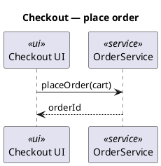

# Linked.Archi and pumllint — boundaries, overlap, fit, gap, sense, nonsense

*Dated evaluation, 2026-08-27, written against `3d64176` (v0.29.0). The
question as posed: investigate `meta.linked.archi` — a tool for linking
artefacts through a semantic layer, modelling the relationships in an
RDF/OWL ontology — and its ecosystem; then assess the boundaries,
overlap, fit, gap, sense and nonsense of the different fits against
pumllint's roadmap and ecosystem.*

**Verdict up front: adjacent, complementary, and worth zero build today.
Linked.Archi is an integration layer — six Java converters lift
ArchiMate, BPMN, PlantUML, Structurizr/C4, Backstage and LeanIX sources
into one RDF knowledge graph, which SHACL then validates and `rdf2docs`
and SPARQL consume. Its declared non-goal is "not a replacement for your
existing tools", naming PlantUML among them. pumllint's declared scope is
the opposite end of the same pipe: the modelling hygiene and maturity of
one `.puml` file before anything reads it. The two meet at exactly one
seam — the source file in a producer repo — and at that seam the
integration is already shipped and needs no code: `pumllint` in the
pre-commit hook or the composite Action, `score --min-level` before
`plantuml2linkedarchi convert`. Everything richer than that runs into the
2026-08-26 knowledge-graph settlement, whose never-build list already
covers the tempting moves and whose four re-litigation triggers are
all about *an adopter*, not about whether such an ecosystem exists. It
does exist, it is impressively complete, and it fires none of them.**

**Two things survive the triage, both small and both measured here. (1) A
real interop gap: the ecosystem's own machine-readable annotations —
`'!la-link OrderService am:realizes kg:REQ-4711`, `'!la-data OrderService
arch:conceptOwner kg:TeamPayments` — are invisible to pumllint's parser,
so GEN006 reports "no ownership tag", GEN007 reports "no requirement
reference", and `pumllint trace` reports the diagram *unlinked* and the
requirement *uncovered*, on a file that carries all three facts in a form
a machine already reads. The fix is one carrier-set extension behind a
config key, and it is externally-authored-convention shaped (the C4
argument) rather than convention-manufacturing (the glossary argument) —
recorded, not queued, adopter-triggered. (2) A new measured integrity-cap
residual, found while probing the one diagram type the converter parses
and pumllint does not: a component diagram scores **Level 1** honestly
(zero modelled elements, C6 cap) until a single `database "…" as DB`
line is added, at which point the same architecture is typed *sequence*,
counts 1 element, escapes the cap and reports **Level 3 (Disciplined)** —
two levels, from one keyword, on a diagram nothing in the catalog can
read. That is the C4 mistyping failure in a second dialect, by a second
mechanism.**

**And one claim this evaluation had to withdraw mid-flight, which is the
most decision-relevant thing in it: the attractive story that pumllint's
`SEQ102` role-type discipline protects the converter's type mapping is
false. The converter's own page states that in a sequence diagram every
participant becomes `uml:Lifeline` "whichever keyword asked for it", with
the keyword republished as `schema:keywords` — "a plain label, not a type
claim" — and that a user-written `<<stereotype>>` "is not read by this
converter". The two products' notions of *type* are not commensurable on
the corpus's dominant diagram type (61 of 174 wild diagrams). Any
"align the vocabularies" proposal starts from there.**

*Bounds. Every pumllint claim below was executed against the working tree
at `3d64176` and the commands are quoted so they can be re-run. Every
Linked.Archi claim was read from its published documentation on
2026-08-27 through a fetch-and-summarise tool; each is given with the
page URL so it can be re-checked, and quoted fragments are as that tool
reported them. **The Linked.Archi tooling was not executed here**: the
converters' source project published on the docs site
(`gitlab.com/linked-archi/linked-archi-tools/converters/converters`)
answered 404 from GitLab's public API on the documented path and HTTP 403
on the project page from this environment, and no prebuilt artefact was
found — so nothing below rests on observed converter behaviour, only on
what its documentation says it does. Where two of its pages read
differently, that is flagged rather than resolved.*

## 0. Why this ran, and what it is not

This is the seventh externally-prompted analysis run under the house
discipline, and the first whose subject is a *shipping external
ecosystem* rather than a proposal, an essay or a review. It follows the
same shape: state the thing so the note stands alone, verify every claim
that can be verified, grade, and record with triggers so it is not
re-derived.

It is **not** a build proposal, and it is **not** a re-litigation of the
knowledge-graph settlement (ROADMAP, *Settled questions*, 2026-08-26).
That settlement asked "should pumllint have a knowledge graph?" and
answered no in all three senses. This note asks a different and narrower
question — "someone else has built one; where do the two touch?" — and
the answer turns out to strengthen the settlement rather than disturb it,
for a reason the settlement predicted in the abstract and this note
observes in the concrete (§6, N2).

Nothing here is queued. §10 records what would have to become true first.

## 1. What Linked.Archi is

### 1.1 The ecosystem

[Linked.Archi](https://meta.linked.archi/) publishes itself as "an open
ecosystem of OWL ontologies, SHACL validation shapes and SKOS taxonomies"
whose purpose is to "turn scattered architecture models into a unified
enterprise architecture knowledge graph". `meta.linked.archi` is the
semantic-asset hub; `linked.archi` is the project's front page.

What it publishes, from [the documentation index](https://meta.linked.archi/docs/)
and [the guide index](https://meta.linked.archi/docs/guide/):

- **A foundation layer** — a core ontology (v0.3.2) of elements and
  relationships, a core visual-notation ontology for diagram interchange
  and styling, core SHACL shapes, and framework-agnostic viewpoints
  aligned to ISO/IEC/IEEE 42010.
- **Extension modules** — architecture decisions (records, forces,
  options), architecture processes (ISO/IEC/IEEE 42020), reference
  architectures, a tactics extension, and quality attributes (ISO/IEC
  25010 and beyond).
- **Metamodels for eight notations** — ArchiMate 3.2 and 4.0, BPMN 2.0.2
  (plus a "BPMN Lite" profile), UML 2.5.1, C4/Structurizr, Backstage
  Software Catalog, SAP LeanIX, Business Model Canvas, EDGY 23.
- **Framework integrations** — TOGAF 9.2/10, DoDAF 2.02, UAF 1.2,
  Zachman, TIME, ATAM, EA on a Page (CSVLOD), Technology Radar.
- **Cross-language SKOS mappings** (TOGAF ↔ ArchiMate, UAF ↔ DoDAF,
  TIME ↔ ArchiMate), worked example models, deliverable templates,
  visual notation sets, and standards alignments (42010, 42020, 12207,
  15288, 25010/25011/25012).

Two design choices are worth naming because they are unusually
disciplined: a **qualified relationship pattern** (an unqualified
predicate for easy querying plus a qualified class carrying the metadata,
reification-friendly and RDF 1.2-compatible), and **derivation rules
carrying PROV-O provenance**, so a derived fact is distinguishable from
an asserted one and annotated with a confidence level. A project that
separates asserted from derived, and says so in the data, is a project
that has thought about the failure mode that kills knowledge graphs.

### 1.2 The pipeline

From [the converters' workflow overview](https://converters-c2cddb.gitlab.io/workflow/overview/),
the shape is two-stage and CI-native:

1. **Producers.** Each team repo holds a `models/` directory of BPMN,
   PlantUML, Backstage catalogs, Structurizr workspaces or ArchiMate
   exchange files. CI runs the matching converter and publishes
   per-notation RDF (TriG) as an artefact.
2. **Aggregation.** A central repo runs `pull-sources.sh`, `validate.sh`
   (SHACL, cross-model) and `merge.sh` into one `merged-graph.trig`,
   which `rdf2docs`, a triplestore and SPARQL then consume.

[The "architecture as code" guide](https://meta.linked.archi/docs/guide/semantic-architecture-as-code/)
describes the PR gate as *syntax check → SHACL validate → SPARQL views →
build artefacts*, with governance expressed as SHACL — its worked
examples being "Every Application Component must have an owner" and
"Every Application Service must realize a Business Service".

[Validation](https://meta.linked.archi/docs/guide/validation/) is a
two-layer shapes model: `core-shapes.ttl` for constraints that hold
everywhere (a qualified relationship has exactly one `arch:source` and
one `arch:target`; `arch:conceptOwner` must reference a Stakeholder),
plus notation-owned shapes — ArchiMate alone carries 97, including 20
principle shapes and SHACL-rule implementations of the derivation rules
DR1–DR8 and PDR1–PDR12. Labels are notation-owned by explicit decision,
because "several notations have legitimately unnamed nodes (BPMN
gateways, ArchiMate junctions)"; every label shape asserts
`sh:datatype rdf:langString`, so untagged strings are rejected.

Two properties of that validator matter later:

- **Conformance is binary.** The page is explicit that under SHACL a
  graph conforms only when the report "contains no results at all", so
  downgrading a shape to `sh:Warning` does not make a graph conform, and
  RDF4J's `ShaclSail` does not distinguish severities either.
- **It knows its own blind spot and says so.** Of its 13 named profiles:
  "Most profiles above use a metamodel's own ontology as the data graph.
  That exercises the shapes constraining enumerated values… but it
  reaches no model instance at all." Instance-targeting shapes therefore
  never fire until paired with example data.

### 1.3 The PlantUML converter, specifically

This is the part of the ecosystem that touches this project, so it is
worth reading closely
([converter page](https://converters-c2cddb.gitlab.io/converters/plantuml/),
[validation](https://converters-c2cddb.gitlab.io/validation/),
[type mapping](https://converters-c2cddb.gitlab.io/config/type-mapping/)).

```
java -jar plantuml2linkedarchi.jar convert diagram.puml \
  --base-iri https://example.org/la/ --model-id demo --format TRIG -o out.trig
```

- **Diagram types**: class, component, sequence, use case, state.
  Activity, mindmap, gantt, JSON and WBS are not listed.
- **Target vocabulary**: the UML 2.5.1 ontology (`uml:` prefix).
  Relationship arrows map to `uml:Association`, `uml:Composition`,
  `uml:Generalization`; state diagrams become state machines with
  `uml:State`, `uml:Transition`, `uml:Pseudostate`.
- **Sequence typing**: "In a sequence diagram every participant is
  `uml:Lifeline`, whichever keyword asked for it — `actor`, `database`
  and `boundary` included." The keyword survives as `schema:keywords` —
  "a plain label, not a type claim". And: "a user-written
  `<<stereotype>>` is not read by this converter."
- **Outputs**: TriG, Turtle, JSON-LD, RDF/XML, N-Triples; multiple
  artefacts in one run. A companion `render` command emits hyperlinked
  SVG (AUTO/DOT/SMETANA layout).
- **Validation** is a *separate* `validate` subcommand run over RDF the
  converter has already produced, against `uml-shapes` + `core-shapes`,
  with `--shapes`, `--without-shape`, `--offline`, `--report`, and exit
  codes 0 conform / 1 violations / 2 error.
- **Extension data** — the ecosystem's convention for putting semantics
  in a `.puml` file, emitted under `--emit-extension-data`:

  ```
  '!la-prefix <prefix> <namespace>
  '!la-link  <element> <predicate> <target> [Forward|Backward|Both]
  '!la-data  <element> <predicate> <literal>
  '!la-view-link <predicate> <target> [Forward|Backward|Both]
  '!la-view-data <predicate> <literal>
  '!la-architecture-state <baseline|target|transitional>
  ```

  so `'!la-link OrderService am:realizes kg:CAP-OrderManagement` emits
  `<…/element/OrderService> am:realizes <…/CAP-OrderManagement>`.
  Misspelled directives are reported rather than silently ignored.
- **Declared losses**: gates and exogenous messages in sequence diagrams
  — "the parser does not read them at all and those arrows are absent
  from the graph"; long relationship identifiers truncated to 180
  characters with a SHA-256 digest appended, the full notation kept in
  `skos:notation`.
- **No quality checking of any kind.** The page carries no linting, no
  required-label rule and no diagram-quality discussion beyond
  `--require-title` (default *false*).

*Caveat, unresolved.* The type-mapping page's row for PlantUML reads
"Stereotype → `UmlTypeDefaults` lookup", while the converter page states
that a user-written `<<stereotype>>` is not read. The two read
differently; the converter page is the more specific and is the one this
note leans on. Whether that is a documentation inconsistency or
"stereotype" used as the name of a keyword slot could not be settled
without the source, which was unreachable (see *Bounds*).

### 1.4 What it says it is not

From [what is Linked.Archi](https://meta.linked.archi/docs/guide/what-is-linked-archi/):
"Not a replacement for your existing tools" — the ecosystem
"deliberately avoids replacing established platforms like Archi, Sparx
EA, PlantUML, or Miro", functioning instead as an integration layer.

That is the single most useful sentence in the investigation, because it
is the other half of pumllint's own boundary. Neither project is
competing for the other's job, and both have said so in their own words.

### 1.5 Provenance and supply-chain read

Recorded because any "adopt it" fit would depend on it, and because the
honest answer is *unverified*:

- The documentation is public, extensive, versioned per asset (core
  assets v0.1–v0.3; language ontologies versioned to their source
  specs), and carries "not an official [vendor] document" disclaimers
  with trademarks attributed. EDGY content is CC BY-SA 4.0.
- **No overall licence statement was found** on the pages read, for
  either the ontologies or the tools. CC BY-SA 4.0 on any embedded
  vocabulary would be a copyleft data licence and would need checking
  against this repo's GPL-3.0-or-later posture before anything was
  vendored — a check nobody needs to run today, because nothing here
  proposes vendoring.
- **No named maintainer or organisation** appears on the pages read.
  `linked.archi` offers "Free Consulting" and lists a Portal as "coming
  soon"; the source repositories published on the docs site were not
  reachable from this environment.
- The GitLab group's public API exposes three model repositories
  (`patterns`, `tactics`, `refarch`), created 2022-06-20, last active
  2023-12 to 2024-03 — while the documentation site describes assets
  aligned to ArchiMate 4.0 and UAF 1.2 (OMG formal/2025-10). The
  public-repo view and the published-docs view do not obviously describe
  the same tempo; neither is evidence about the other.

Net: **a serious, well-built, well-documented body of semantic assets of
unverified licence and unverified provenance.** That combination is fine
for reading and reasoning about — which is all this note does — and is
not yet a thing to depend on.

## 2. The seam

Reduced to the one line that matters:

```
producer repo                                    central repo
─────────────────────────────────────────────    ──────────────────────────
diagram.puml ──► [ pumllint ] ──► [ convert ] ──► [ SHACL ] ──► merged graph
                 lint / score      → TriG          conformance    rdf2docs
                 exit 0/1/2                        exit 0/1/2     SPARQL
                  ▲                                  ▲
        is the diagram worth              is the graph structurally
        converting at all?                well-formed?
```

pumllint runs **before** the converter, on the artefact a human wrote.
SHACL runs **after** it, on the triples a machine emitted. They ask
different questions of different objects at different times, and the
questions do not substitute for one another in either direction:

- A diagram that says `do stuff`, `TBD` and `...` is Level 2 with DIM-AMB
  at zero here (measured — knowledge-graph evaluation §9.2). Downstream,
  nothing in the published shape set addresses it: the documented
  constraint classes are cardinality, domain/range, enumerated-value
  membership, label presence and language-tagging — none of which
  inspects what a label *says*. That is an inference from the published
  shapes, not an executed result (see *Bounds*), but it is the inference
  the shape catalogue supports.
- A diagram whose `alt` block is never closed, or whose participant is
  used but never declared, is caught by SEQ004/SEQ001 as `critical`
  before conversion — and, per the converter's own documentation of what
  it does not read, may simply be *absent* from the graph afterwards,
  where absence of a triple is indistinguishable from absence of a fact.

This is the whole complementarity, and it requires no code on either
side. The integration is `pumllint` in the producer repo's pre-commit
hook or CI job, gated with `score --min-level` — which is what the
composite Action and `.pre-commit-hooks.yaml` already are.

## 3. Overlap — five points, and who owns each

| Concern | pumllint | Linked.Archi | Reading |
|---|---|---|---|
| **Ownership** | GEN006 `owner-tag`, DIM-TRC, dormant until a `pattern` is configured | core `ConceptOwnerShape` (`arch:conceptOwner` must reference a Stakeholder); worked governance rule "Every Application Component must have an owner" | **Same rule, two artefacts.** pumllint asks whether the *author wrote it down in the diagram*; SHACL asks whether the *graph carries a resolvable owner*. A `.puml` can fail the first and pass the second (the owner arrives from another source at merge), or pass the first and fail the second (an owner named in prose that resolves to nothing). Neither is redundant. |
| **Requirement / capability linkage** | GEN007 `requirement-link` + `pumllint trace` (bipartite matrix reporting covered / unlinked / dangling) | `'!la-link X am:realizes kg:REQ-…`, then SPARQL over the merged graph | **Same rule, different carrier — and the carriers do not see each other.** This is the measured gap (§8). |
| **Naming and labels** | GEN004, CLS001, ACT005, ACT006, UC002 — regex-configurable conventions over the name a human chose | label shapes requiring `skos:prefLabel` with `sh:datatype rdf:langString`; the converter emits the label itself | **Disjoint.** pumllint checks the *content* of a name; the shapes check the *presence and typing* of a label the converter generated. Neither reaches the other's failure. |
| **Identity / entity resolution** | XD001–005 across one lint batch; per-entity `authoritative` golden-record pin; deliberate refusal to elect a majority winner | cross-repository identity conflicts surfaced at aggregation; `--ns-global-id` for cross-model links | **Same discipline, different radius, genuinely complementary.** pumllint resolves identity inside a repo before conversion; the aggregator resolves it across repos after. The recorded pumllint trigger for widening that radius is a *cross-repository identity ask* — which this ecosystem's existence describes but does not supply. |
| **Type discipline** | SEQ102 requires a role type or `<<stereotype>>`; participant `kind` is load-bearing for SEQ107, XD001, XD002 | UML metaclass typing; **every sequence participant is `uml:Lifeline` regardless of keyword**, keyword kept as `schema:keywords`, user stereotypes not read | **Not commensurable.** See §7, F6. This is the one place the intuitive story is wrong. |

## 4. Boundaries — four lines, and neither project crosses them

1. **Artefact vs aggregate.** pumllint's unit is a file (and, for the XD
   pack, one batch). Linked.Archi's unit is the merged graph across
   repositories and notations. Neither has an opinion about the other's
   unit.
2. **Report vs reject.** pumllint's product *is* the graded finding —
   severities, six dimensions, five levels, a prescriptive gap report, a
   ratchet, an auto-fixer. SHACL conformance is binary by the
   specification and by RDF4J's implementation, as Linked.Archi's own
   validation page states. A gate that can only say yes or no cannot
   express "Level 3, and here are the two findings blocking Level 4".
3. **Source vs projection.** Both tools are tolerant projections of
   PlantUML — pumllint skips lines it does not recognise (which is why
   103 of 174 wild diagrams are dialect-invisible), and the converter
   documents that gates and exogenous messages are "absent from the
   graph". The difference is what each does about it: pumllint *reports*
   the projection (the C6 zero-element cap, the "Syntax gate: not run"
   disclosure, the census's coverage suspects); a SHACL report has no
   way to say "this constraint was never reached because nothing parsed".
4. **Author-time vs integration-time.** pumllint runs in the editor, the
   pre-commit hook and the PR. Linked.Archi runs in CI and at
   aggregation. The failures each is designed to catch belong to
   different people on different days.

## 5. Sense — the four true things

**S1. The complementarity is real and it is the strong kind.** Not "these
tools are both about diagrams" but: the downstream validator is
structurally incapable of catching the upstream defect class, *by its own
documentation*. Conformance is binary; the converter drops what it cannot
read; the shapes' own published blind spot is that most profiles never
reach an instance. The defects a `.puml` file can carry *through* a clean
conversion — a vague label, an unlabelled transition, prose where an
operation signature belongs, an elided guard — are the ones no documented
shape class inspects, because those classes are about cardinality,
domain/range, value-set membership and label typing, never about what a
label says. (Ownership is the interesting exception and is graded in §3:
their core shapes *do* check it, on the graph, later.) That is precisely
the catalogue pumllint ships, and it is precisely the argument
the README has made since the first commit, now with a second,
independently-built pipeline demonstrating the gap instead of only
PlantUML's renderer.

**S2. The ecosystem is an existence proof for the positioning, not for a
build.** The tooling-landscape settlement (2026-07-26) positioned this
project's category as "deterministic verifiers for AI-read/AI-written
artifacts" and called it the pipeline's under-built layer. Linked.Archi
is a large, careful, standards-aligned investment in the *integration*
layer that ships no verifier for its own most human-authored input
format. That is corroboration of the gap claim from an unusually
credible direction — someone who built the neighbouring layer properly
and left this one empty.

**S3. The extension-data convention is externally authored, published and
machine-read — which is the C4 argument, not the glossary argument.** The
model-verification settlement parked the glossary/approved-term rule
because "building it would manufacture a convention, not check one". The
C4 settlement went the other way because c4model.com's checklist
"supplies an externally-authored rule spec". `'!la-link` / `'!la-data`
sits on the C4 side of that line: someone else wrote the convention down,
published its grammar, and built a tool that reads it. That does not make
it *pulled* — no adopter here uses it — but it does mean the
convention-manufacturing objection is not the one that applies.

**S4. Their admitted blind spot is the one this repository already has an
instrument for.** "Most profiles use a metamodel's own ontology as the
data graph… it reaches no model instance at all" is the same finding
`tools/corpus_firing.py` produced here on its first run: SEQ102, SEQ104,
SEQ107 and SEQ109 fire zero times across all 97 calibration units plus
the wild tier. Two independent rule-authoring projects, the same
unexercised-constraint failure, one of them with a standing instrument
for it. Recorded as an observation about the discipline (§7, F7) — not as
work.

## 6. Nonsense — five moves to refuse

**N1. "Adopt Linked.Archi and retire the rule catalog." Refused — it
deletes the product.** SHACL conformance is binary; the maturity model,
the ratchet, the gap report, the badge and `pumllint fix` all require
that an ill-formed model be constructible, inspectable and *scoreable*.
This is the well-formedness-as-a-type anti-goal (2026-08-02) meeting a
real implementation of itself.

**N2. "Use OWL/SHACL as the rule engine, over the converter's RDF."
Refused, and the refusal is now empirical rather than predicted.** The
knowledge-graph settlement's second ground for this was that closed-world
shape validation over a *tolerant projection* reports absence of parse as
absence of fact. That was an argument about pumllint's own parser.
Linked.Archi's converter documents exactly the same property from the
other side — gates and exogenous messages "absent from the graph" — so
the hazard is not hypothetical and not this project's alone: it is a
property of the pipeline shape. Anything built on "lint the RDF instead
of the source" inherits it.

**N3. "Emit findings into the graph and query quality with SPARQL."
Refused on the standing Goodhart ground, and unnecessary on the cheap
one.** Publishing the maturity score as a graph property invites
optimisation against a number calibrated by an execution oracle and
frozen behind a golden test — the graph-derived-metrics refusal
(2026-08-26, N5) with a different transport. And it is unnecessary:
`-f json` is schema-pinned, the schemas ship, and an RDF-native pipeline
lifting a JSON report into triples is a short script in the consumer's
repo, not a format in this one. (The *reporter* question is separate and
is graded below as F3.)

**N4. "Align pumllint's participant kinds with the UML ontology."
Refused because the alignment does not exist.** Documented above: every
sequence participant becomes `uml:Lifeline`; the keyword is a label, not
a type claim; user stereotypes are not read at all. pumllint's kinds are
behaviour-oriented and load-bearing — SEQ107 fires on calls to
`<<external>>`/database/queue participants; XD001/XD002 resolve kind and
stereotype conflicts across diagrams. Mapping a live discriminator onto a
vocabulary that flattens it is not alignment, it is loss.

**N5. "Ship a Linked.Archi integration (a converter, an RDF reporter, an
MCP bridge) to ride the ecosystem's adoption." Refused on the Arc E
bar.** The bar is *a concrete user whose need the current tool cannot
meet*. There is no such user, and the lesson already recorded against the
SonarQube plugin applies with more force here: a second release train
bound to a third party of unverified licence and unverified maintenance
tempo, for a capability the shipped JSON already serves.

## 7. Fit — the candidate fits, graded

Seven ways the two could be put together. One is already shipped, one is
the real gap, two are refused, two are gated, one is not this project's
work at all.

### F1 — pumllint as the pre-conversion gate in a producer repo. **Sense; already shipped; zero build.**

The strongest fit is the one that needs nothing. Linked.Archi's producer
repos hold `.puml` under `models/` and run a converter in CI; pumllint
ships a composite GitHub Action, two pre-commit hooks, exit codes 0/1/2
and `score --min-level`. A producer repo adds one job before the convert
step and is done. Neither tool needs to know the other exists — which is
the property that makes this fit robust to everything unverified in §1.5.

*Status: available today. Nothing to record but the recipe, and the
recipe is `docs/setup-and-ci.md` unchanged.*

### F2 — SHACL as, or behind, the rule engine. **Nonsense; already on the never-build list.**

Covered by N1 and N2. The addition this evaluation makes to the
2026-08-26 record is evidentiary, not directional: the tolerant-projection
hazard is now observed in a second, independently built pipeline that
documents the same losses. Re-litigating this would need new evidence
about *severity-graded* conformance, which SHACL does not have.

### F3 — an RDF/Turtle reporter (`-f trig`) for lint and score output. **Plausible, cheap, and refused today — the honest substitute already ships.**

This is the one genuinely new candidate the ecosystem suggests, and it
deserves a real grade rather than a reflex. In its favour: the reporter
seam is already the pluggable one (the HTML report cost nearly nothing
for exactly this reason); Turtle is text, so a stdlib emitter is feasible
and the zero-dependency promise holds; the sonar reporter is precedent
for emitting into a foreign contract.

Against, decisively:

- **A new public contract.** The JSON report shapes are schema-pinned
  because CI scripts parse them. An RDF shape would need the same
  treatment — its own schema/shapes, its own sync tests, its own
  re-freeze discipline — and it would be pinned to *someone else's*
  ontology version, which is the ontology-drift failure mode imported
  wholesale.
- **It has to mint IRIs in a namespace this project does not own** to be
  joinable with the graph it is meant to join.
- **The substitute is 20 lines in the consumer's repo.** `-f json` plus
  the shipped schema is a complete, versioned description of every
  finding and every dimension score. An RDF-native shop converts that to
  triples more cheaply than this project can maintain a Turtle emitter.

*Recorded, not queued. Trigger: an adopter running both pipelines who
asks for it after trying the JSON route and finding it insufficient —
and the reason it was insufficient, which is the part that would tell us
what shape to emit.*

### F4 — read the ecosystem's `'!la-` annotations as governance carriers. **The one real gap; measured; recorded, not queued.**

See §8. Cheapest item in this note, best-argued, still zero-adopter.

### F5 — a component/deployment pack. **Already the standing Arc C candidate; this note adds corroboration and one new defect, and moves no trigger.**

Component is the single diagram type the converter parses that pumllint
does not, and Arc C already names "component and deployment first" as the
next type packs. What this evaluation adds is a measurement (§8.2)
showing that pumllint's *current* output on component input is not merely
absent but, in one common configuration, wrong in the direction that
matters — mirroring the C4 finding. The Arc C bar (mutation ladders,
clean probes, additive golden re-freeze, pilot regeneration, ideally an
evidence extension) applies unchanged, and the trigger stays what it was:
census pull or a concrete user.

### F6 — adopt the ontology as pumllint's type/identity vocabulary. **Nonsense as stated; one half of it is a live, unfired trigger.**

The *type* half is refused (N4): the vocabularies are not commensurable
on the corpus's dominant diagram type. The *identity* half is different
and better: IRIs as a global identity space is a coherent answer to the
recorded cross-repository-identity question, and Linked.Archi supplies
`--ns-global-id` for exactly that. But that item's trigger is "a concrete
cross-repository identity ask that the recorded sequence↔contract and
`trace` items cannot serve" — and an ecosystem that *could* be asked is
not an ask. Unchanged.

### F7 — pumllint's corpus-firing instrument against Linked.Archi's shapes. **Not this project's work.**

Their published blind spot (§5, S4) is answerable with the method
`tools/corpus_firing.py` embodies: run the constraints over real
instances and report where they fire and how often. Recorded because the
convergence is interesting and because it is worth knowing that the
instrument generalises. The house does not build for other projects, and
nothing here proposes it.

### Fit against declared constraints

| Declared constraint | Where a Linked.Archi integration lands |
|---|---|
| **Zero runtime dependencies** | **Passes** for F1 (no coupling), F3 and F4 (both stdlib-expressible). **Fails** for anything running SHACL/RDF4J, which is a JVM stack. |
| **Deterministic product path, no LLM** | **Passes** throughout. Nothing in this ecosystem asks for an LLM leg. |
| **Byte-stable, contract-pinned outputs** | **Passes with a new burden** for F3 — a Turtle serialisation needs deterministic ordering and a pinned shape, the same tax `_variant_summary` already pays. |
| **Statelessness** | **Passes** for F1/F3/F4. The graph is the *other* system's state, which is the point. |
| **Demand-driven / the Arc E bar** | **Fails for every candidate but F1.** No adopter runs both. This is the gate that decides the note. |
| **Golden score contract** | **Manageable, and non-zero for F4**: teaching GEN006/GEN007 a new carrier stops them firing on annotated files, which shifts scores and takes a deliberate re-freeze. |
| **Licence posture** (GPL-3.0-or-later; never AGPL; no EPL) | **Unverified, and that is the finding.** No licence statement was found for the ontologies or the tools (§1.5). Irrelevant while nothing is vendored; a blocker for anything that would be. |

## 8. Gap — measured

### 8.1 The ecosystem's own annotations are invisible to the rules that want them

`prose_directives()` in `pumllint/model.py` is deliberately the *single*
definition of where a governance tag may live — "one carrier set, so the
rule and the traceability matrix cannot disagree" — and it is
`title`, `header`, `footer`, `caption`, `note`. PlantUML comments are not
directives, so the ecosystem's convention lands outside it entirely.



Run against this repo's own config (which configures both patterns):

```
$ python3 -m pumllint annotated.puml
annotated.puml:1: [GEN006/minor] No ownership tag matching '(?i)owner\s*:' in title/header/footer/caption/notes
annotated.puml:1: [GEN007/minor] No requirement/ADR reference matching '…|REQ-\d+' in name/title/header/footer/caption/notes

$ python3 -m pumllint trace annotated.puml --requirements reqs.txt
Requirement coverage: 0/1 covered — 1 uncovered, 1 unlinked diagram(s) — across 1 diagram(s)
REQ-4711  ✖ uncovered
Unlinked diagrams (no requirement reference):
  annotated.puml [checkout] (sequence)
```

And the parser's own view confirms the mechanism — the six `'!la-` lines
produce no directives at all:

```
type: sequence  name: checkout  elements: 4
directives: [('title', 'Checkout — place order')]
```

So: a diagram carrying its owner and its requirement in a form a machine
already reads is reported as having neither, and its requirement is
reported *uncovered* while the link sits four lines above the first
participant. That is a genuine false negative against an external,
published, machine-read convention — the failure mode GEN006/GEN007 were
made dormant-by-default to avoid in the first place.

**The fix is small and lands where the design already put it.** One
carrier-set extension behind a config key (`[rules.GEN007] carriers =
["directives", "la-extension"]`, or a general `comment_pattern`), because
`prose_directives()` is the single seam and `trace` consumes it. It is a
scoring change — annotated files stop losing DIM-TRC — so it takes a
deliberate golden re-freeze under the working agreements.

**And it is still not queued**, for the reason every item in these
records is not queued: no adopter. The honest label, borrowed from WS3a
and the link-integrity check: *externally-authored convention, zero
observed users here.* What makes it the best candidate in this note is
that the convention is written down by someone else and its grammar is
published — so building it checks a convention rather than inventing one
— and that the same seam serves the rule, the score and the matrix at
once.

### 8.2 A component diagram's honesty cap turns on one keyword

Probing the type the converter parses and pumllint does not turned up
something not previously recorded. Two files describing the same
architecture, differing by one line:

```plantuml
@startuml payments-components-plain      @startuml payments-components-db
title … (owner: payments) REQ-4711       title … (owner: payments) REQ-4711
package "Payments" {                     package "Payments" {
  [Payment API] <<service>>                [Payment API] <<service>>
  [Ledger] <<service>>                     [Ledger] <<service>>
}                                          database "PaymentsDB" as DB
[Payment API] --> [Ledger] : posts entry }
@enduml                                  [Payment API] --> [Ledger] : posts entry
                                         [Ledger] --> DB : writes
                                         @enduml
```

```
$ python3 -m pumllint score component_plain.puml -f json
  type='unknown'   level=1  score=100.0  elements=0
$ python3 -m pumllint score component_db.puml -f json
  type='sequence'  level=3  score=100.0  elements=1
```

The parse explains it exactly: `database "PaymentsDB" as DB` is a
sequence-participant declaration, so the file is typed `sequence`, the
database becomes the diagram's one recognised element, and one element is
enough to clear the C6 zero-element cap (Level 4 needs three). No
component, no package, no relationship is read — `messages` is empty —
yet the verdict moves from *Level 1 (Sketchy), no modelled content* to
*Level 3 (Disciplined)*.

Three honesty notes, because this is easy to over-read:

- **It is a coverage/typing observation, not a rule defect.** Every rule
  does what its catalog row says; there is no component parser, and the
  sequence recognizer is doing its documented job.
- **It is one probe, not a corpus measurement.** How often a real
  component diagram carries a `database`/`queue`/`actor` declaration is
  unmeasured; the wild census types 103 of 174 diagrams `unknown` but
  records no component marker, so it cannot answer this.
- **Any fix is a scoring change** — whether a component parser (F5), a
  stricter type discriminator, or extending the integrity-cap family with
  a "typed by a single element" disclosure — and takes its own decision
  and a deliberate golden re-freeze. It belongs beside C6, C7 and the
  syntax-gate disclosure: structural honesty about what was never read.

For contrast, the ArchiMate-PlantUML dialect — the macro form of
Linked.Archi's flagship notation — behaves correctly today:

```
$ python3 -m pumllint score archimate.puml -f json
  type='unknown'  level=1  score=95.0  elements=0
  gap: diagram has no modelled content — add elements before scoring means anything
```

The cap holds, and the report says why. The component case is the one
that slips through, and it slips by exactly one element.

### 8.3 How much of a real corpus this is even about

From the recorded wild census (`pilot_results/first_contact/census.json`,
159 files / 174 diagrams / 950 nodes+edges):

| Diagram type | Census count | pumllint parses | converter documents |
|---|---|---|---|
| sequence | 61 | ✔ | ✔ (all participants → `uml:Lifeline`) |
| state | 5 | ✔ | ✔ |
| class | 2 | ✔ | ✔ |
| usecase | 2 | ✔ | ✔ |
| activity | 1 | ✔ | ✖ (not listed) |
| component | — (typed `unknown` here) | ✖ | ✔ |
| unknown | 103 | — | — |

The two declared type surfaces overlap on **70 of 174 diagrams (40%)** of
the only third-party corpus this project has measured. The 103
dialect-invisible diagrams are dominated by preprocessor and macro
dialects — 118 of the 159 files carry `!include`, 102 carry
`!define`/`!procedure` forms, and 73 carry C4 macro calls. The PlantUML
converter's page documents neither C4-PlantUML macros nor `!include`
handling, and the ecosystem lists Structurizr/C4 as its own converter
alongside PlantUML — so on the evidence available, hand-written
C4-PlantUML is *documented by neither side*. That is weaker than "unserved"
and stronger than nothing: it is the same niche the 2026-07-27 C4
settlement bounded ("hand-written C4-PlantUML files only"), with a second
toolchain declining to claim it in writing. It does not move that
settlement's census trigger.

## 9. SWOT

Scope: *pumllint's position relative to the Linked.Archi ecosystem*.

**Strengths (internal, favourable)**

- The complementarity is structural, not incidental: graded findings
  before conversion, binary conformance after, neither substitutable.
- The integration that matters is already shipped (Action, hooks, exit
  codes, `--min-level`) and requires no coupling in either direction.
- pumllint reports its own projection (C6 cap, syntax-gate disclosure,
  census coverage suspects); the downstream stack structurally cannot.
- The rule catalog's shape — dormant-by-default convention rules with
  configurable patterns — is exactly the shape that absorbs a foreign
  convention cheaply if one is ever pulled.
- The evaluation record itself: this question landed on a settled
  question one day old and resolved against it in hours rather than
  re-deriving it.

**Weaknesses (internal, unfavourable)**

- No component (or deployment) parser: the one type the converter reads
  that pumllint does not, and the one where its output currently
  misleads (§8.2).
- Governance carriers are closed to a published external convention
  (§8.1) — a false negative against a convention that exists.
- 40% type-surface overlap on the only measured foreign corpus; the
  dialect-invisible majority is served by neither tool.
- No adopter runs both, so every judgment here is about fit, not about
  observed friction.

**Opportunities (external, favourable)**

- A producer-repo gate is a legible, zero-cost adoption story for a
  constituency (EA teams doing architecture-as-code in CI) that already
  believes in gating and already runs PR checks.
- The ecosystem's own admitted blind spot (unexercised shapes) is the
  problem `tools/corpus_firing.py` solves — evidence the method
  generalises beyond this repo.
- If the pilot census ever meets an organisation running an EA knowledge
  graph, the cross-repository identity trigger and the F4 carrier gap
  would fire together, cleanly, with a concrete ask attached.

**Threats (external, unfavourable)**

- **Category confusion.** "There is already a semantic layer for
  PlantUML" is an easy and wrong reading; the answer is that it converts
  and conforms, it does not lint. Worth being able to say in one
  sentence.
- **Ontology drift, imported.** Any emitted RDF shape (F3) or adopted
  vocabulary pins this project to another's versioning — the named
  number-one KG failure mode, taken on second-hand.
- **Unverified licence and provenance** (§1.5): fine to read, not yet a
  thing to depend on.
- **Scope creep by adjacency.** Six converters, eight notations and forty
  framework alignments make a large surface to feel behind. The Arc E bar
  exists for exactly this feeling.

## 10. Decision, recorded candidates, triggers

**Decision: no build, no dependency, no integration artefact. The one fit
worth having (F1) is already shipped and needs no code.** Filed in the
settled-questions style so it is not re-derived.

**Never build** (each already implied by a standing settlement; recorded
here against this ecosystem so the next proposal lands on it):

- SHACL/OWL as pumllint's rule engine, over the converter's RDF or
  anything else — binary conformance deletes the graded product, and
  closed-world shapes over a tolerant projection is now a documented
  property of *both* pipelines.
- A vendored or bundled ontology, of any licence, on the product path.
- pumllint findings or scores emitted as graph properties *for querying
  quality* — the graph-derived-metrics refusal with a different
  transport.
- Any alignment of pumllint's participant kinds to `uml:Lifeline`.

**Recorded, not queued:**

1. **`'!la-` extension-data as a governance carrier** — an opt-in carrier
   extension so GEN006, GEN007 and `pumllint trace` can read the
   ecosystem's published annotations (§8.1). One seam
   (`prose_directives()`), one config key, a deliberate golden re-freeze.
   Honestly labelled: *externally-authored convention, zero observed
   users here* — the C4 argument, not the glossary argument. **Trigger:
   an adopter or pilot corpus using Linked.Archi annotations in `.puml`
   files, or any second consumer of the same convention.**
2. **The component-diagram typing residual** (§8.2) — one
   sequence-participant keyword inside a component diagram both mistypes
   the file and lifts it past the zero-element honesty cap, moving the
   verdict from Level 1 to Level 3 on a diagram nothing can read. Next
   member of the integrity-cap family (C6, C7, syntax-gate disclosure,
   the DIM-AMB residual). Any fix is a scoring change with its own
   decision and re-freeze. **Trigger: the component pack (Arc C) being
   built, or a census/corpus showing the pattern is common.**
3. **An RDF/Turtle reporter (F3)** — feasible, stdlib-expressible, and
   refused today because `-f json` plus the shipped schema already serves
   an RDF-native consumer at lower cost and without importing another
   project's versioning. **Trigger: an adopter who tried the JSON route
   and can say why it was insufficient.**
4. **The one-sentence positioning answer** — "Linked.Archi converts and
   conforms; it does not lint" — worth having ready if the category
   question is ever asked in an adoption conversation. Documentation
   candidate only; no behaviour change.

**Re-litigate this settlement on any of:**

- An adopter or pilot organisation running Linked.Archi (or any
  RDF/SHACL EA pipeline) with PlantUML producers — which would fire F4's
  trigger and probably F3's, and would be the first observed friction
  rather than assessed fit.
- A concrete cross-repository identity ask arriving *through* such a
  pipeline — the standing 2026-08-26 trigger, unchanged, now with a
  plausible source named.
- The converter gaining severity-graded or coverage-aware validation
  (i.e. SHACL results that distinguish "violated" from "never reached"),
  which would move the §4 boundary-2 argument.
- The census meeting a corpus where component diagrams are material,
  which fires F5's existing Arc C trigger and candidate 2 with it.
- A published licence and maintainer statement for the ontologies and
  tools, if anything downstream ever wanted to depend on them — a
  precondition, not a trigger.

## Related reading

- [A knowledge graph for pumllint, evaluated](knowledge-graph-evaluation.md)
  — the settlement this note lands on (2026-08-26): the graph already
  exists, externalizing it fails on scale, and the never-build list this
  evaluation extends with a named external instance.
- [ROADMAP.md](../ROADMAP.md) — settled questions, the Arc E build bar
  every fit above is triaged against, and Arc C's component/deployment
  candidate.
- [C4-PlantUML pack: fit evaluation](c4-pack-evaluation.md) — the nearest
  prior: an external, published, machine-readable convention assessed as
  a rule source, with the same mistyping failure measured a dialect
  earlier.
- [Model verification beyond linting](model-verification-evaluation.md) —
  the well-formedness-as-a-type anti-goal §6/N1 rests on, and the
  glossary keeper §5/S3 contrasts against.
- [First contact: the pilot census on a public wild corpus](pilot-census-first-contact.md)
  — the 174-diagram / 950-element corpus §8.3 counts.
- [Setup and CI integration](setup-and-ci.md) — F1 in full, unchanged:
  the producer-repo gate is the Action and the pre-commit hooks that
  already ship.
