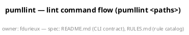

# The lint-flow diagram, explained construct by construct

*This page is a detailed description of the PlantUML source in
[`pumllint-lint-flow.puml`](pumllint-lint-flow.puml) — the repository's
own architecture diagram, and the artefact of the
[dogfooding run](dogfooding.md). Read it to learn what a Level-4
diagram looks like construct by construct, to check the diagram against
the code it draws, or to see the house style the rule catalog rewards
applied to a real flow. PlantUML terms are introduced as they appear;
rule IDs refer to [RULES.md](../RULES.md). Line numbers refer to the
checked-in file.*

## What the file is

A **sequence diagram**: participants across the top, time flowing
downward, arrows for calls and replies. This one draws what happens
when a developer runs the default lint command, `pumllint <paths>` —
the exact flow implemented by `_run_lint` (`pumllint/cli.py:168`). The
same file is both documentation and test surface: pumllint lints it in
CI, it scores Level 4 (Precise) 100/100 with three disclosed
suppressions, and the [dogfooding page](dogfooding.md) records what
that run taught.

## The header block (lines 1–3)



Three lines, three rules satisfied:

- `@startuml pumllint-lint-flow` gives the diagram a **name** — the
  identifier tools and reports use. Without it, GEN002
  (unnamed-diagram) fires.
- `title` gives the human-readable one-liner — GEN001
  (missing-title). Note the title contains literal angle brackets
  (`<paths>`): content the parser must not trip over, which is part of
  why this diagram is a useful test surface.
- `footer` carries the repository's governance conventions: an
  `owner:` tag (GEN006, owner-tag) and references to the spec
  documents (GEN007, requirement-link). Both rules are
  **convention-gated** — dormant until a project configures its own
  pattern in `pumllint.toml`, which this repository does. The footer
  is a *tag carrier*: pumllint reads header/footer/caption directives
  precisely so governance metadata can live inside the artefact it
  governs.

## The cast (lines 5–12)

```plantuml
actor Developer
participant CLI
participant Config
participant Engine
participant Registry
participant Parser
participant Rule
participant Reporter
```

Every lifeline is **declared before use** — an undeclared name would be
SEQ001 (undeclared-participant), and a declared-but-unused one SEQ002.
Names are PascalCase per GEN004 (participant-naming). One deliberate
distinction: `Developer` is typed as an `actor` (a human), the seven
components as bare `participant`. On the default profile that is fine;
under the opt-in **codegen profile**, SEQ102 (codegen-untyped-
participant) flags all seven bare declarations but not the typed
actor — the typed keyword carries the mapping signal code generation
needs. This is the main reason the diagram is Level 4, not Level 5:
Level 5 requires the codegen contract, and this diagram deliberately
documents the default experience instead.

Each participant maps to real code:

| Lifeline | What it stands for |
|---|---|
| `CLI` | `_run_lint` in `pumllint/cli.py` — argument parsing, wiring, exit code |
| `Config` | `load_config` in `pumllint/config.py` — explicit path or auto-detection |
| `Engine` | the `Engine` class in `pumllint/engine.py` — rule wiring and the lint pipeline |
| `Registry` | the rule registry in `pumllint/rules/__init__.py` — `discover()` over `_REGISTRY` + `catalog.toml` |
| `Parser` | `parse_file` in `pumllint/parser/sequence.py` — one parser for all diagram types, elements typed by their syntax markers |
| `Rule` | any registered rule class — `check(diagram)` / `check_all(diagrams)` |
| `Reporter` | `get_reporter` in `pumllint/reporters/base.py` — text / json / sonar rendering |

## Invocation and configuration (lines 14–24)

```plantuml
Developer -> CLI : pumllint paths [--fail-on sev] [-f format]
activate CLI
```

The opening message label states the **CLI contract**, options
included — a labelled arrow (an unlabelled one would be SEQ005), and
an `activate` that opens the CLI's activation bar. Every `activate` in
the file is closed by a matching `deactivate` (SEQ003,
unbalanced-activation); the CLI's own bar stays open until line 79,
spanning the whole command.

```plantuml
CLI -> Config : load_config(explicit path or auto-detect)
activate Config
Config --> CLI : config (rules, profile, suppressions)
deactivate Config
```

Solid arrows (`->`) are calls; dashed arrows (`-->`) are replies. The
reply label says *what comes back* — the three things the engine needs:
rules configuration, active profile, suppression settings. The attached
`note right of Config` documents the auto-detection order
(`pumllint.yaml` / `.yml` / `.toml` / `.json` in the working
directory) — a note used for genuine reference information, not for
narrating structure (structure-in-notes is what the note-density guard
GEN008 exists to discourage; this diagram has two notes across ~24
messages, well under any threshold). The note's text also names
`pumllint.yaml` literally — more content the parser must treat as
prose, not as a participant.

## Engine construction (lines 26–36)

```plantuml
CLI -> Engine : Engine(config)
activate Engine
Engine -> Registry : discover()
...
' Intended self-call: rule wiring is Engine-internal by design (RULES.md SEQ006).
' pumllint: disable=SEQ006
Engine -> Engine : instantiate rules\n(profile gating, disables, severity escalation)
Engine --> CLI : engine (rules wired)
deactivate Engine
```

`discover()` returns the registered rule classes plus their
`catalog.toml` metadata; the engine then instantiates them, applying
profile gating (which rules are active), configured disables, and
severity escalation. That step is drawn as a **self-message**
(`Engine -> Engine`) — and here the diagram becomes its own test
surface. SEQ006 (no-self-message) flags self-messages because they
often smuggle in narration; but rule wiring genuinely is
Engine-internal, so drawing it any other way would falsify the
architecture. The resolution is the two-comment pattern above the
arrow: a **rationale comment** for the human reviewer, then the
machine-readable escape hatch `' pumllint: disable=SEQ006` scoped to
the next line. The multiline label (`\n`) is also deliberate: labels
with line breaks are ordinary content the parser must handle.

## The lint pipeline (lines 38–57)

```plantuml
CLI -> Engine : collect_files(paths)
activate Engine
note right of Engine
  Each argument resolves as directory, then existing
  path, then glob pattern — PowerShell and cmd.exe
  do not expand wildcards for native programs.
end note
Engine --> CLI : diagram files
```

`collect_files` (`engine.py`) turns arguments into diagram files
(`.puml`, `.plantuml`, `.iuml`, `.wsd`): a directory recurses, an
existing path is taken as-is, and only a leftover argument holding a
glob character is expanded as a pattern — the branch that keeps
`pumllint *.puml` working where the shell does not expand it. The CLI
drives collection itself rather than delegating to `lint_paths`,
because it also reports what the search did *not* find: a warning when
nothing was collected, and one naming files that held no `@startuml`
block. The note is ordinary diagram furniture the parser must handle.

```plantuml
loop each collected diagram file
    CLI -> Parser : parse_file(file)
    ...
end

loop each diagram, each applicable rule
    Engine -> Rule : check(diagram)
    ...
    ' pumllint: disable=SEQ006
    Engine -> Engine : drop findings suppressed by inline disable comments
end
```

Two `loop` **fragments** (PlantUML's repetition blocks), each with a
labelled condition — an unlabelled block condition would be SEQ007.
The first loop: `parse_file` returns *a list* of diagrams, one per
`@startuml` block, which is why the reply says "one per startuml
block". The second loop runs every applicable rule's `check` per
diagram, then filters findings through the inline-suppression
mechanism — the third suppressed self-message, and the most pointed
one: **the arrow documents the exact mechanism that is cleaning the
diagram it appears in.** Every fragment is properly closed with `end`
(SEQ004, unterminated-block — the rule PlantUML's own grammar does not
enforce; the [syntax-gate measurements](dogfooding.md) showed
`-checkonly` tolerates unclosed blocks entirely).

## The cross-diagram pass (lines 59–64)

```plantuml
opt batch holds two or more diagrams
    Engine -> Rule : check_all(diagrams) for cross-diagram rules
    Rule --> Engine : cross-diagram violations, attributed to owning diagram
end
```

An `opt` fragment (a conditional that either runs or doesn't) with an
explicit guard: cross-diagram rules (the XD family — conflicting
kinds, stereotypes, name-case collisions across files) only make sense
when the batch holds at least two diagrams. `check_all`
(`pumllint/rules/__init__.py:95`) is the rule-side entry point; the
reply label records the attribution contract — every cross-diagram
finding is pinned to the diagram that owns it, so reports and
baselines stay per-file. This `check_all` label is the line the
original SEQ103 shape-check wrongly blessed prose through — the
finding that became the tightened argument-list heuristic.

## Reporting and the exit contract (lines 66–84)

```plantuml
Engine --> CLI : violations sorted by (file, line, rule id)
deactivate Engine

CLI -> Reporter : get_reporter(format).render(violations)
...

alt no finding at or above --fail-on
    CLI --> Developer : report, exit 0
else findings at or above --fail-on
    CLI --> Developer : report, exit 1
end
deactivate CLI

note over CLI
  Config or path errors abort earlier
  with exit 2 (usage error).
end note
```

The engine's reply pins the **ordering contract** (findings sorted by
file, line, rule id — determinism CI can diff). `get_reporter`
(`pumllint/reporters/base.py:47`) selects the output format named by
`-f`. The `alt` fragment (an if/else block, both branches labelled)
draws the **exit-code contract**: exit 0 below the `--fail-on`
threshold, exit 1 at or above it — the two arrows back to the
Developer close the interaction, and the final `deactivate CLI`
balances the `activate` from line 15. The closing note completes the
error surface: usage errors (bad config, bad paths) abort earlier with
exit 2. Failure paths drawn, not implied — the property the codegen
pack demands of every external call, honored here for the flow's own
contract.

## Why it scores the way it does

Everything above compounds into the recorded result — Level 4
(Precise), 100/100, three suppressed findings:

- **Satisfied by construction:** named diagram (GEN002), title
  (GEN001), governance footer (GEN006/GEN007 under this repository's
  configured conventions), all participants declared and used
  (SEQ001/SEQ002), PascalCase names (GEN004), every message labelled
  (SEQ005), every block labelled (SEQ007) and terminated (SEQ004),
  activations balanced (SEQ003), notes sparse and referential
  (GEN008), well under the size guards (GEN005/GEN009/SEQ011).
- **Deliberately kept, then governed:** three `Engine -> Engine`
  self-messages (SEQ006) — drawn because the architecture is really
  like that, suppressed with reviewable inline comments, disclosed in
  every score report as `(3 suppressed)`, and resurfaced in full by
  `--no-suppressions`.
- **Deliberately not claimed:** Level 5. The codegen profile would
  demand typed participants (SEQ102) and signature-shaped labels
  (SEQ103) throughout; this diagram documents the default experience
  instead, and the Level-5 gate refuses the promotion without that
  contract — a contract, not a point total.

One caveat travels with all of it, from the dogfooding verdict: craft
is not truth. This page verifies that the diagram is *precise* and
that its constructs map to real, named code locations — the mapping
table above is checked by eye, not by machine. A rule that checks the
diagram *against the code* is exactly the diagram↔code-conformance
adjacency the [roadmap](../ROADMAP.md) records as watch-don't-build.

## Re-verifying

The commands, expected outputs, and change-interpretation rules are in
[dogfooding.md](dogfooding.md), "Re-running the checks."
