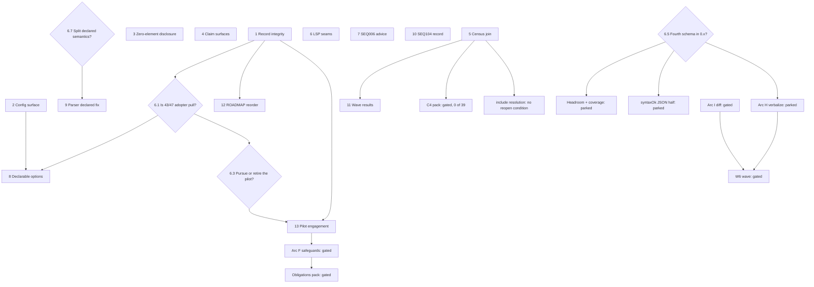

# What is next — a SWOT prioritisation of the open roadmap

*Dated prioritisation note, 2026-08-31, written against `dd9814c` (v0.30.0).
The question as posed: research the roadmap documents in this repository and
determine what is next, prioritised with a SWOT approach, taking dependencies
and levers into account. Method and bounds in §9; every claim this note
executed in its own environment is marked ✔ and reproduced in §10.*

**Verdict up front: the next move is not a build. The record and the tracker
have diverged — ten owner-filed issues, including the only capability-pull
ledger this project has ever received, appear in none of the 101 markdown
files (✔) — and until that is repaired, roughly half the queue's gate status
is guesswork. Under that sits a tier of seven ungated defect fixes, none of
which needs a trigger, a golden re-freeze or a schema bump, and several of
which are single tokens. Everything large on the table is gated, and — with
one contested exception — the gates are honest. The right response to a queue
of honest gates is to clear the ungated defects, not to argue a gate open.**

## 1. The finding that reorders the queue

This project's organising principle is demand-gating. Fifty-nine settled
records each carry a written trigger (✔), and the discipline is real enough
that the record repeatedly refuses its own convenient readings: the pilot
census note pre-emptively disclaims itself as demand, and the 2026-08-27
exclusion guard invalidates the project's own loudest prevalence figure.

`ROADMAP.md:5256-5261` *(at `dd9814c`; the sentence now lives inside a
superseded 2026-07-24 record at line 556, after the 2026-09-03 hoist)*
states the consequence: *"no committed follow-ups
remain; everything is strictly demand-driven."*

**That sentence is not true of its own repository.** On 2026-08-24 ten issues
were filed in one sweep — #30, #33, #35, #37, #41, #42, #43, #44, #47, #49.
Two of them are the capability-pull ledger the Arc E bar has been waiting for
since 2026-07-24, from a consumer running a 24-diagram production model set
under `profile = "codegen"` at `--fail-on info`, gated at `score --min-level
5` and `trace` with all three fail flags:

| Ask | The measurement filed with it |
|---|---|
| Headroom / near-miss reporting (#43.1) | sat at **30/30** on SEQ011's cap and **3/3** on SEQ008's on five diagrams at once, with no signal from any command |
| Positive-coverage command (#43.2) | guard *binding* ranges **0% to 100%** per diagram across files that all score exactly 100/100 |
| `--self-check` (#43.3) | hand-built negative control whose recorded counts later failed to reproduce, because the procedure lived in prose |
| XD006 operation-owner consistency (#43.4) | **5 disagreements, 2 verified true defects**, base rate 1 disputed operation in 85 |
| `allowed_stereotypes` on SEQ102 (#43.5) | a closed 18-token vocabulary enforced by a README table and review, nothing else *(built 2026-09-04)* |
| `reply_pattern` on SEQ109 (#47.1) | the convention holds at **126 of 126** replies and is checked by nothing *(built 2026-09-04)* |
| `verb_pattern` + set reporting on ACT006/UC002 (#47.2) | **68 configured verbs, 30 distinct first words used, 38 (56%) dead** *(built 2026-09-04)* |
| XD007 signature drift, advisory (#47.3) | 16 keys drawn twice, **8 diverge**, none unambiguously a defect — hence advisory |
| Declared correspondence scope (#47.4) | met with a hand-built ~500-line manifest and resolver instead |
| Note-prose advisory (#47.5) | notes carry **14.6% of corpus bytes**; **two recorded real defects lived in note prose**, at a perfect score |

`grep -rn 'capability pull\|production consumer\|issues/43\|issues/47'
--include=*.md .` returns nothing across all 101 markdown files at `dd9814c`
(✔) — this note and its ROADMAP entry are the first two references.
Meanwhile `ROADMAP.md:5277` still names the pilot census as the next action,
dated 2026-07-30 with an addendum ending 2026-08-11.

So the roadmap is simultaneously *waiting for pull* and *not recording the
pull it has*. That is why record integrity ranks first: it is the input to
every other judgement on this table, not housekeeping.

**The same divergence has a second instance one file apart.** `ROADMAP.md:278`
marks the LSP **BUILT 2026-08-31**; `ROADMAP.md:5260` *(at `dd9814c`)* — in *Working
agreements*, the section headed *"read before picking anything up"* — still
lists *"Arc E's LSP server and SonarQube plugin (wait for pull)"* (✔). The
wrong half is the one a work-selection turn reads first, and it sits 4,982
lines below the corrected checkbox.

### The contested exception

Whether #43/#47 counts as *third-party adopter pull* or as *maintainer
self-demand* changes the gate status of at least eight items on this table.
The analysis pass traced the consumer to `akantai/J-F` — the corpus of
[the J-F audit](foreign-corpus-audit.md) — on matching fingerprints (24
diagrams, five types, Level 5 100/100 at zero variance for its whole life,
the ~73% false-positive measurement, the hand-built negative-control battery),
and reported that the repository is not publicly reachable.

**This note does not adopt that finding, because it could not execute it.**
From this environment `github.com/akantai/J-F` and `github.com/akantai` both
return **403** while the control `github.com/fdurieux/pumllint` returns
**200** (✔) — an egress artefact, not evidence about GitHub. What *is* in the
repository and needs no network is `docs/foreign-corpus-audit.md:146`, which
already self-labels the property: *"Corpus is public and licensed — **Audit
record** — asserted there, not independently verified here"* (✔).

That line is the honest hook. The question below is put to the owner (§6.1),
not answered here.

## 2. The project-level SWOT

**Strengths.**

- The demand discipline is load-bearing and self-correcting — 59 records, each
  with a written trigger, and a documented history of the record invalidating
  its own favourable numbers.
- The mechanisms are CI-enforced and they hold: RULES.md → `extract_features`
  → pytest-bdd with a staleness gate, golden scores over 97 units, byte-pinned
  pilot artefacts, catalog↔registry parity. Baseline at `dd9814c`:
  **584/584 stdlib, 706 pytest** (✔).
- The zero-dependency promise holds end to end, through a 1,727-line stdlib
  JSON-RPC LSP with no third-party imports.
- **Contact with foreign material is the highest-yield activity on record.**
  One read-only pass over 24 third-party diagrams returned four genuine
  defects (SEQ107 F1/F2, GEN005's use-case budget, the replacing `lexicon()`
  helper), all fixed in v0.29.0. Nothing else in the history has that ratio.
- The honesty mechanism on foreign dialects works in the wild: on 159 public
  files the zero-element cap held 100 of 174 diagrams at Level 1, and the
  census found zero non-UML forms — the failure mode everyone worries about
  did not occur.

**Weaknesses.**

- Record and tracker have fully diverged (§1).
- Doc-vs-code drift on shipped surfaces: `cli.py:3` announces *"Five
  commands"* and omits `lsp`, which ships and is documented in README (✔);
  `README.md:239-240` states Level 5 is *"bound to the `codegen` profile so it
  cannot be claimed without those rules running"* while `README.md:244-246`
  concedes four lines later that the check is an **opt-in** flag (✔);
  `RULES.md:2430` still summarises STA002 as *"No unreachable states"*, which
  is the precise allegation of open issue #49 (✔).
- **The config surface fails silently on its own documented input.**
  `engine.py:345-355` treats only the *scalars* `False` / `"off"` /
  `"disabled"` as a disable, so a table-form `[rules.GEN001]` with
  `enabled = false` falls through as *options* and the rule stays armed (✔).
  Unknown top-level, rule and option keys are accepted at exit 0 with no
  warning. #37 records the cost in the consumer's own words: it silently
  weakened an experiment whose "rules disabled" control was running all rules.
- The decision log is **89.8% settled questions** — 4,771 of 5,310 lines, 59
  closed records against 15 open items — with *Working agreements* beginning
  at line 5225 of 5310 (✔). Measured growth over 2026-08-28 → 08-31 is
  ~865 lines/day, so this worsens monotonically.
- SEQ102/104/107/109 fire zero times across all 97 calibration units,
  recorded since 2026-07-30 with no gate attached and no disposition.

**Opportunities.**

- Real capability pull exists, enumerated with a measurement per item, and its
  cheapest entry (`allowed_stereotypes` on SEQ102) is a plain rule option on
  machinery that already ships — `pattern_option` at `rules/__init__.py:89-96`
  with four existing users.
- Two prevalence corrections are already computed against data on disk, and
  would remove the only quotable warrant for the two largest gated builds.
- The product-facing claim surfaces **under-sell** six waves of evidence, and
  the corrected wording is already drafted at
  `docs/pilot-kickoff-pack.md:15-27` — a copy-down, not a writing act.
- Repairing the frozen four-name tuple at `tests/test_packaging.py:85` covers
  every future command for free (✔).
- Deleting one token at `cli.py:402` makes the `!include` disclosure that
  shipped 2026-08-28 fire on the population it was written for.

**Threats.**

- **Cheap-and-ungated work keeps winning.** 19.3% of the codebase landed in
  four commits on 2026-08-31 on a maintainer ask, while ten defect issues sat
  unreferenced for a week. Each of those builds is individually defensible;
  *the sequence* is the risk, and it is the risk this note exists to name.
- Two attractive measurements are traps that look green under the existing
  tests: the else-label-only SEQ107 narrowing shows 0/97 golden drift and 58
  green tests *and* fires a false positive on any `alt` whose failure branch
  is written first; flipping `c7_requires_applicable_rules` breaks the
  documented `l5_requires_profile` retarget for any house profile.
- **The golden snapshot cannot see the codegen/profile scoring path at all** —
  `tools/_scorelib` calls `score()` with no engine, so `profile_applies` is
  always `None`. Every score-affecting change in that region ships with no
  regression coverage while appearing fully covered.
- Structural constraint binding across nine candidates at once:
  `additionalProperties: false` on all three shipped schemas forces every new
  report field into a new command or a new format.

## 3. The ranked queue

Verdicts use the house vocabulary: **do-now** (ungated, ready), **do-next**
(ready behind a listed dependency), **decide-then-do** (blocked on a §6
decision), **park** (trigger written, not fired).

### Tier 1 — ungated, ready, ~2 days in total

No item in this tier needs a trigger, a golden re-freeze or a schema bump.

**1. Record integrity — reconcile the tracker into the record.** *(M, do-now.)*
Write ROADMAP entries for #43 and #47; repair the two *Working agreements*
bullets that contradict `ROADMAP.md:278`; correct the RULES.md summary rows
that contradict their own corrected sections; annotate the provenance line at
`foreign-corpus-audit.md:146`. **Lever: converts eight items' gate status from
guesswork to known, and is the precondition for posing §6.1 cleanly. Nothing
else on the table improves the reading of everything else.** Trigger: none
needed — the corrections were made and not propagated, which is the standing
house discipline, not demand-gated work.

*Explicitly out of scope:* the `tools/link_check.py` idea. Measured on this
repository it returns 21 findings and 0 defects, and would not have caught any
of the four corrections it is offered to prevent.

> **BUILT 2026-09-03 — and sized M, it was L.** The four bullets above were
> the visible tip. Exploration found the record had drifted in every
> direction the note itself diagnosed and in three it had not: **22 stale
> "LSP unbuilt" sentences across seven `docs/` notes** (the ROADMAP mirrors
> had been annotated on 2026-08-31; the sources never were); **six**, not
> two, false sentences in *Working agreements*, including "(when built)
> tracing" for a command that shipped in v0.25.0; four catalog descriptions
> still carrying overclaims that issue #40 / PR #50 removed from the
> *messages* (SEQ103/105/107/109 — visible in `--list-rules`); GEN008
> mis-tiered as lexical in four places while its code divides by
> `element_count`; the `ref over`-recommended-by-SEQ006 premise surviving in
> five places after PR #120 changed SEQ006; the `!include` disclosure still
> marked *Recorded, not queued* in two places after it shipped and was
> fixed; and the Lark/ANTLR reason dead since the LSP shipped.
>
> **The uncomfortable one:** my own two ROADMAP entries from PRs #120 and
> #121 cited prioritisation ranks and never issue numbers — the same
> divergence PR #119 was written to fix, one layer down. Six of ten issues
> were still unreferenced in ROADMAP; #41, #42 and #44 had no substantive
> mention anywhere.
>
> Every correction is an in-place dated annotation, never a rewrite of a
> dated record. The provenance row was **split in two**: it named the licence
> while §6.1 leaned on it for arm's-length status, and the second is now
> stated as *not establishable here*. Rank 12's hoist was folded in, because
> the orientation layer sitting 5,100 lines below the checkboxes it
> contradicts is *why* every one of the six Working-agreements sentences
> went stale unread. Two open items were queued with no trigger — the
> input-order dependence (Arc A, a defect) and the `option_keys` declaration
> (Arc E) — and #33, #37 and #49 were closed with carve-out comments.

**2. Config-surface integrity — the three verified #37 defects.** *(S,
do-now.)* Make a table-valued `[rules.X]` honour `enabled = false`; warn on
stderr for unknown top-level, rule and option keys; make `--list-rules`
(which returns before `load_config` at `cli.py:431-443`) reflect loaded
config. Fold in the crash surfaced alongside: an empty `class_pattern:` dies
with an `AttributeError` at `rules/class_/structure.py:33` and exits 1 —
indistinguishable from "findings were found" under the exit-code contract.
**Lever: hard prerequisite for rank 8.** Trigger: none — this is wrong
behaviour on documented input, and the working agreements gate new
capability, not defects.

> **BUILT 2026-09-03, and the defect is larger than filed.** The line pointers
> above are stale (`cli.py:443-448`, `load_config` at `:455`), and the crash is
> not one site but **fourteen**, with a single root cause: `.get(option,
> default)` at `rules/__init__.py:89-96` returns the *explicit* null, so the
> sentinel wins and the declared default never applies. Five `pattern_option`
> sites crash `AttributeError`; eight more crash `TypeError` on null int, list
> and lexicon options; a list-rooted config adds one at `engine.py:19`. **All
> exited 1** — indistinguishable from lint findings, which is precisely what
> `rules/__init__.py:35-38` says must never happen. Fixed with one guard at
> `Rule.__init__` rather than fourteen patches: *null is never a value; omit
> the key.* Dormancy-by-omission is untouched, and TOML cannot express null, so
> the blast radius is YAML/JSON only.
>
> Unknown-key checking ships for **top-level keys and rule ids only**. Option
> keys have no declaration to check against — `catalog.toml` has no `options`
> field, and `codegen.py` generates option names dynamically
> (`extra_<lexicon>`) — so that is recorded rather than built, paired with the
> `DORMANT` column, since both want the same missing declaration. Warnings, not
> errors, per §6.6.
>
> *Built 2026-09-04: the declaration landed as three optional `catalog.toml`
> fields (`options`, `lexicons`, `dormant_unless`), the disclosure names the
> legal keys, `--list-rules` tags `[dormant: needs …]`, and an AST guard holds
> the declaration to the reads. The "dynamic" lexicon names measured as five
> literals. Warnings still, per §6.6. ROADMAP, that date.*
>
> `--list-rules` now loads the config and annotates each row with
> disabled / profile-gated / severity-escalation state. It had **no test at all**
> before this change.

**3. Zero-element / dialect-invisible disclosure.** *(XS, do-now.)* Delete
`bool(entities) and` from `cli.py:402` (✔). As written, the `!include`
hidden-declarations warning cannot fire on the case where the include hid
*everything* — the exact census population it was written for. Reported reach:
2 diagrams unpatched, 35 across 18 files patched, zero false positives.
Trigger: the recorded adopter trigger has **not** fired; frame this as a
defect in shipped code, narrower than its own specification, not as a fired
trigger.

> **BUILT 2026-08-31 — and the "one token" framing above was wrong.** Deleting
> `bool(entities)` outright introduces a *new* false positive: the entity list
> counts only participants, classes and states, so an activity diagram with an
> `!include` and real nodes has zero entities and would be told it "declares
> nothing". Measured: activity + include + 3 nodes → `entities=0`,
> `element_count=3`. The shipped predicate is therefore two conditions, not one
> token — nothing declared **and** (entities exist **or** `element_count == 0`).
> All four pre-existing fixtures behave identically; the two genuinely-hidden
> shapes now warn; the activity case stays quiet. Two tests added, since the
> guard had no test pinning either behaviour.

**4. Claim-surface repair — the C7 sentence and the evidence paragraph.**
*(S, do-now.)* Rewrite `README.md:238-245` so the guarantee sentence matches
the opt-in flag four lines below it (✔), and bring the evidence sentence
current: it rests the whole case for the gate on one 2026-07-22 judged wave
(r ≈ 0.49) and never mentions the execution oracle carrying the 16–25 pp
cliff across three prompt styles, two oracles, three generators and two
vendors. **Fix the sentence, not the default** — see §6.4. Trigger: fired.
`minimum-sufficient-stack.md:232` heads its section *"Product consequences
(wording only; every build stays gated)"* — wording propagation is the one
class the project licenses without pull.

> **BUILT 2026-09-03 — three files, not one, and the paragraph was wrong in two
> directions.** The load-bearing falsehood is precisely the clause *"so it
> cannot be claimed without those rules running"*: the binding is string
> equality on a profile **name**, and the substance half is the opt-in flag.
> Verified by running — an activity diagram under `--profile codegen` scores
> **Level 5, 99.1/100** with zero codegen rules applicable, since every SEQ10x
> rule is sequence-only. `docs/case-for-pumllint.md:108-110` **repeated the same
> overclaim** and is corrected too; `SCORING.md` §4 needed nothing — it was
> already right.
>
> On the evidence: README under-sold *and* mis-sourced. It rested the whole case
> on one 2026-07-22 judged wave (r ≈ 0.49) — the very leg XV1 refuted across a
> vendor boundary (judged-vs-executed agreement **r = 0.002**) — while the
> executed 16–25 pp cliff, which needs no judge, went unmentioned. Both are now
> stated, failures included, and §9 carries a dated block for the three later
> waves. The default was **not** flipped, and `tests/test_scoring.py` is
> untouched: it pins today's behaviour and is the oracle the wording must match.

**5. Census instrument fixes and the marker-by-source join.** *(S, do-now.)*
C4 macros are 66 of 71 from C4-PlantUML's own `samples/` and `percy/` trees;
under the 2026-08-27 exclusion guard the published 46% becomes 7 of 88 (8.0%)
and **0 of 39** in `hyperledger/aries-rfcs`, the only working-project corpus
in the census. `!include` goes the same way: 118/159 → 47/88 → **0/39**.
Separately the instrument has four defects, including `str(f)` at
`tools/pilot_census.py:143` and `:212` emitting backslashes on Windows against
the forward-slash contract, and `hit[:3]` taking the alphabetically-first
three — which systematically hides the repository contributing 66 of 73 hits.
**Lever: removes the one number a future session could read as partial warrant
for the two largest builds.**

> **BUILT 2026-09-03 — and §9's caveat on these figures can now be lifted.**
> Every number this note carried from the analysis pass was **independently
> re-derived**: all five marker totals reproduce exactly (118 / 73 / 102 / 0 /
> 1), C4-PlantUML carries **66 of 73** C4-macro hits and 71 of 118 `!include`
> hits, `aries-rfcs` carries **zero of both**, and the guard arithmetic is
> 46% → 8.0% (7/88) → **0 of 39**. §8.4's bound of "at most 70" tightens to 66.
>
> Two defects were worse than filed. **(a)** is not just 104-vs-89: the whole
> 15-row excess is *one* 16-diagram file, and since rows sort by ratio it
> **monopolised all 15 slots of the default display** — one filename, sixteen
> times. **(c)** is quantified: the three examples came from the two *smallest*
> contributors (5 hits combined) while the repository holding 66 of 73 never
> appeared, which is exactly why the overlap could only be bounded before.
>
> Three things are **recorded, not repaired**, because repairing them moves
> published figures with no pre-registration: `census.json` is hand-post-processed
> (it carries a `note` key the instrument never writes); its engine-dependent
> figures have drifted at v0.30.0 (levels 31/35/8/100 → 30/36/8/100); and the
> level distribution is **input-order dependent** — same 159 files, different
> order, `L2:9` vs `L2:8`. That last one is new, and given "scores are a public
> contract" it deserves its own investigation as a *scoring* question.
>
> Provenance, stated in the published note: the re-clones were scratch working
> copies authorised by matching commit hashes, not repository material. The
> join is reproducible by repeating the clone, not from this repo alone.

**6. LSP seams — `--help`, the frozen tuples, the fallback test.** *(XS,
do-now.)* `cli.py:3` says *"Five commands"* and omits `lsp` (✔). Both
packaging tests state in their own docstring that *"the epilog must name every
command"* and then iterate a frozen four-name tuple at
`tests/test_packaging.py:85` (✔) — which is exactly why `lsp` shipped
undiscoverable. Replace the tuple with a list derived from an explicit
module-level `_SUBCOMMANDS` that `main()` itself consumes. **Lever: the
repaired guard covers every future command for free.** Trigger: fired against
a self-declared invariant that is false today.

> **BUILT 2026-08-31.** Two findings the build added. First, the epilog is
> *derived* from the module docstring (`cli.py:43` slices it), so correcting
> the docstring fixed `--help` with no second edit. Second, the two guards
> want **different** sets: `action.yml` deliberately rejects `lsp` with exit 2,
> because a stdio language server has no meaning as a CI step. Deriving both
> from one list would have been wrong, so the Action guard derives from
> `_SUBCOMMANDS` minus a declared `_ACTION_EXCLUDED`, with a third test
> asserting the exclusion is real in `action.yml` and not merely declared in
> `cli.py`. The fallback test was repointed: it drove `textDocument/hover`,
> which became supported on 2026-08-31, so the "unknown request still gets a
> reply" branch it names had gone uncovered while staying green.

**7. SEQ006's remediation text.** *(S, do-now.)* The one fact in the
`ref over` cluster that has actually fired: SEQ006 tells the author *"consider
a note or 'ref over' instead"* (`rules/sequence/flows.py:122`) and the parser
drops `ref over` entirely, so taking the linter's own advice removes behaviour
from the model that no rule can then see. Amend the message and its mirrors.

> **Corrected 2026-08-31, when this item was built.** Three claims above were
> wrong and are recorded here rather than quietly rewritten.
>
> 1. **The mirrors were misidentified.** `RULES.md:220` is GEN005's rationale,
>    not SEQ006; SEQ006's section is `RULES.md:825-860` and contains no
>    remediation text at all. `README.md:269` mirrors the *catalog
>    description*, not the finding message.
> 2. **The scope was one rule too narrow.** Three rules recommend the dropped
>    construct: SEQ006, **SEQ011** (`flows.py:230`) and **GEN005**
>    (`governance.py:118`).
> 3. **The score claim does not hold as stated.** Measured on one diagram:
>    self-message 8 elements / 96.88; `ref over` 7 / **100.00**; `note` 7 /
>    **100.00**. A note scores *identically*, so the rise is simply what
>    happens when a finding is fixed — it is not a `ref over` pathology. The
>    real defect is narrower: a note stays in the model (SEQ106 reads it,
>    GEN008 counts it) while `ref over` is in nothing, and it is the only one
>    making a cross-diagram claim the tool silently drops.
>
> **Consequent fix, differentiated rather than uniform:** SEQ006 now
> recommends a note alone — it was the only rule offering `ref over` as a
> *same-file* substitute. SEQ011 and GEN005 keep it, because there the content
> genuinely moves to another file that pumllint lints in its own right; they
> gain a caveat that the reference is not resolved. Parsing `ref over`
> (Option 4 of that analysis) stays parked on its existing trigger.
>
> **BUILT 2026-08-31.** No `extract_features.py` run was needed: the BDD step
> vocabulary has no step that asserts message text at all, so no Gherkin
> anywhere can pin a finding string. The captured transcript at
> `d2-ecosystem-reexamined.md:94` was annotated rather than rewritten — it is
> a dated record of a run.

### Tier 2 — the one demand-backed build

**8. Declarable convention options on existing rules.** *(M, do-next.)*
`allowed_stereotypes` on SEQ102, `reply_pattern` on SEQ109, `verb_pattern` on
ACT006/UC002. The only build on this table with a per-item measurement from a
named consumer (§1). The mechanism ships. **Lever: settles the list-or-regex
option shape once for every future configurable rule, and demonstrates that
recording capability pull leads somewhere.**

*Dependency:* rank 2, hard. Three new snake_case option keys — the class most
likely to be mistyped — landing on a surface where a typo is accepted at exit
0 is a net honesty regression.
*Gate:* fired on the Arc E bar as written, but both issues self-rank these as
*"the lower-priority entries"* and say *"Recorded, not queued"*, and the
provenance question (§6.1) is open. Contingent.
*Scope note:* split set-style reporting out. Collapsing N findings into one
moves DIM-CON density scores invisibly to CI and puts the LSP's squiggle on
`@startuml`.

> **BUILT 2026-09-04**, after §6.1 was answered yes and rank 2's option-key
> disclosure shipped that morning. All three options, default-off; the
> list-or-regex shape settled as a rule (allow-list ∪ allow-pattern,
> deny-list ∩ pattern) in writing-rules.md. The measurements that made
> dormancy a necessity rather than a courtesy — 0 of 226 replies here match
> the consumer's shape, 2 stereotype tokens against 18, no verb list anywhere
> — are in the ROADMAP entry of that date. Set-style reporting stays split
> out, as this scope note asked.

### Tier 3 — decisions with work attached

**9. Parser fidelity: `participants.setdefault`.** *(S+, decide-then-do.)*
`parser/sequence.py:319` never overwrites, so a participant declared *after*
first use keeps `declared=False, kind="implicit"` and discards its display
name and stereotype — while the class parser does the right thing at
`class_.py:142-152`. The same three-line diagram scores Level 4 / 97.8 /
exit 0 or Level 3 / 81.8 / exit 1 depending only on declaration order. The
eight-line fix runs green, **but incidence is zero across 208 files** and it
silences SEQ010 on precisely the case SEQ010 exists to catch. Settle §6.7
first. Lever: low — nothing waits on it.

**10. SEQ104: record the flip result honestly.** *(S, do-next.)* WS3b has been
measurement-gated since 2026-07-30. The latent defect reproduces (a call in an
`alt` branch whose reply sits in the mutually exclusive `else` yields no
SEQ104, because `pair_calls_and_replies` at `model.py:473-508` walks a flat
line-sorted event list and never consults `diagram.blocks`), and a prototype
returns 0 true flips over all 169 repo diagrams. But **the specified input
never arrived** — the trigger named a corpus this repository does not have.
Write the EVIDENCE.md entry scoped as *"zero flips on every diagram this
repository authored"*, not *"the gate is closed"*, and add the false-negative
fixture.

**11. Propagate wave results into the living evidence documents.** *(S,
do-next.)* `minimum-sufficient-stack.md` §7 presents its tally as *"the
falsifier ledger, for honesty at a glance"* and shows five FAILED where the
frozen records now carry eight; its preamble and `docs/README.md:859` both say
five frozen records and ≈$32.65 where there are seven and ≈$57.26; charter §7
has no W1b entry. And both `pilot-kickoff-pack.md:133` and
`minimum-sufficient-stack.md:243` recommend the PlantUML carrier with no
generator scoping, which W3b measured as opus-borne. *Dependency: rank 5.*
*Defer the §7 recount* — W1b returns three DILUTION BRANCH verdicts and W3b a
SPLIT, none of which has an existing bucket, and a confidently wrong recount
in the honesty artefact is worse than a stale-but-traceable one.

**12. Reorder the ROADMAP — do not split it.** *(XS reorder / M split,
do-next.)* Hoist *Working agreements* and the open arcs above *Settled
questions* inside the one file: identical orientation win, zero staleness,
minutes. **The proposed split is the expensive shape** — 16 citation sites
across 11 files name the section by file, including `README.md:893`'s public
licensing commitment and a frozen W3b pre-registration, none as anchors, with
no link checker to catch the staleness. Write the rotation policy the file has
never had. *Dependency: rank 1.*

> **BUILT 2026-09-03, folded into rank 1 as its own commit.** Pure move: the
> Working-agreements block (117 lines) now sits directly after Arc J, the
> decision log follows, and the file's line count is unchanged. No citation
> site moved — all 16 name the section by file. The self-measurement was
> refreshed in place rather than the figure quietly changing: 89.8% → 89.1%,
> 59 → 63 records, 15 → 17 open items, orientation 5225 → 498. **What the
> hoist bought was verified before it was made**: exploration found six
> stale sentences in Working agreements that three consecutive PRs had each
> corrected the file *around* without touching — because the section headed
> "read before picking anything up" was the last thing in a 5,600-line file.
> The rotation policy is the one line now in the layout note at the top:
> *annotate dated records in place rather than rewriting them.*

**13. The pilot — decide, do not start.** *(XL, decide-then-do.)* Half the
published 1.0 gate and the named trigger behind fourteen ROADMAP trigger
lines, and the only item no session can start: all five charter roles are
literal `*[name]*` / `*[team]*` and scope is `*[N]* repositories` over
`*[4-6]* weeks`, unchanged since the template was written. The self-issued
next action is dated 2026-07-30 while 120 commits landed. The one census that
ran was disclaimed in the record itself as *"prevalence measurement, not
adopter pull"*. **Lever: very high if it fires — it is the demand instrument
the C4 pack, include resolution, Arc F, the obligations pack, Arc H and
`--shadow-config` all name — and exactly zero until it does, because it cannot
be fired from inside this repository.** See §6.3.

## 4. Dependencies



Ranks 3, 4, 6, 7 and 10 have no prerequisites and can land in any order, or as
five commits. The only hard edges inside Tier 1–2 are **2 → 8** and
**5 → 11**.

## 5. Levers

Ranking weights leverage over effort. Three items dominate:

1. **Record integrity (rank 1)** — the highest-multiplier item on the table,
   because it is the only one that changes how every other item reads. Eight
   items' gate status is currently unknowable.
2. **The packaging-tuple repair (rank 6)** — an XS fix that covers every
   future command for free. The strongest trigger class this repository
   recognises: a guard the project wrote, stated as an invariant twice, and
   then broke.
3. **The pilot (rank 13)** — the highest ceiling and a floor of zero. Fourteen
   trigger lines depend on it; it has been unmoved for 32 days; it cannot be
   started from inside this repository.

Two second-order levers worth naming: **rank 2** is the difference between
shipping rank 8 as a capability and shipping it as a new silent-failure
surface; and **rank 5** is what stops a future session reading 46% as warrant
for the C4 pack.

## 6. Owner decisions

Each is a yes/no that this note cannot answer.

1. **Does the #43/#47 consumer count as third-party adopter pull for the Arc E
   bar?** At least eight items' gate status turns on this. See §1's contested
   exception — and note that `foreign-corpus-audit.md:146` already declines to
   vouch for the corpus's provenance. *(Answered 2026-09-04: **yes**, an
   arm's-length adopter. The audit row is left as it stands — the answer was
   about the consumer, and this note never adopted the identification of the
   consumer with the corpus.)*
2. **Should any of the ten asks be queued now?** Both issues say *"Recorded,
   not queued… five entries in one ledger, not five work items."* If yes, is
   `allowed_stereotypes` on SEQ102 the right first one? *(Answered
   2026-09-04: the three option asks, built together — `allowed_stereotypes`
   was not the right first one, since the lever is the shape rule and a plain
   list never touches it; the other asks keep their recorded status.)*
3. **Do you still intend to pursue a pilot organisation?** If no, should
   `README.md:86-89`'s 1.0 gate be reworded to drop the pilot half, and the
   fourteen dependent triggers re-based on something reachable?
4. **Should `c7_requires_applicable_rules` become the default?** It closes
   #35's substance bypass, but as a bare flip it breaks the documented
   `l5_requires_profile` retarget for any house profile and ships with zero
   golden coverage — a yes means widening `_applies()` in the same change.
5. **Is a fourth pinned JSON Schema acceptable inside 0.x?** This one answer
   settles #30's `syntaxOk` tri-state, headroom reporting, the positive-
   coverage command, unmodelled-content disclosure, `verbalize` and the k-way
   diff — all currently blocked by `additionalProperties: false` on the three
   shipped schemas.
6. **Should unknown config keys stay a stderr warning?** A no means
   `--strict-config` or exit 2, which is a change on the hardest contract in
   CLAUDE.md and is not requested by anyone.
7. **Should `Participant.declared` split into "declared at all" and "declared
   before first use"?** SEQ001 wants the first and SEQ010's own docstring
   wants the second, so a bare fix trades one false negative for another.
8. **Should `foreign-corpus-audit.md:146` be sharpened, and are you willing to
   retire README's third-party standing-fixture caveat using a corpus whose
   arm's-length status the record does not vouch for?**

## 7. What is deliberately not recommended

Every rule pack, every new command, every new schema field and every research
wave. Their triggers are written down and none has fired. Three will keep
coming back and are worth naming:

- **The C4 pack** — motivation reproduces at HEAD in both directions, but the
  trigger now reads **0 of 39** on working-project material under the
  record's own exclusion guard. Real motivation, measured-zero demand.
- **`!include` resolution** — its recorded trigger was already *consumed* by
  the disclosure that shipped 2026-08-28 (it fired O2, not N5), so it sits on
  a `Never build` list with no reopen condition at all. If it is ever to move
  it needs a new trigger written from scratch, not a re-firing.
- **Arc F** — not free interim work. Its own trigger is the same adopter yes
  that queues a pack; four of its five items are unbuilt; and item 3's diff
  gate as specified excludes `tests/` while every shipped rule's stdlib
  coverage lives in `tests/test_rules.py`, so a rule authored under it would
  be invisible to `python tests/run_tests.py`.

Also parked, each for a reason already in the record: XD member/relationship
coherence, XD006 and XD007 (the trigger asks for *"a second corpus or an
adopter"*, and #47's own title says it is the *same* consumer as #43 — one
anecdote counted twice); XD display-name identity (9 of 432 entity sites carry
a display name, 0 cross-alias collisions); `ref over` capture and the `'!la-`
carrier (zero annotations in any `.puml`); GEN010 declared correspondence
scope *(the GEN010 id went to `duplicate-diagram-name` on 2026-09-04; this
candidate would take GEN011)* (the consumer met the need with its own manifest and never asked to
replace it); SARIF, RDF/Turtle, a real SonarQube plugin and MCP (the ten
recorded asks contain no format and no integration); the obligations pack;
`--shadow-config`; the note-prose advisory (the asking consumer runs
`--fail-on info`, so an info rule is a gate on day one); Arc H, Arc I, Arc J
and waves W6/W7; and the ROADMAP split (§3, rank 12).

## 8. Two candidates that dissolved under verification

Recorded so they are not re-derived:

- **Type-fallback / typing-confidence disclosure.** The 159-file census found
  **zero** non-UML forms and capped 100 of 174 diagrams at Level 1. Every
  Level-4 mis-typing on record is a hand-built probe wrapped in `@startuml`,
  and the proposed fallback-plus-zero-declared predicate would fire on ~1/8 of
  `aries-rfcs`' honest sequence diagrams. Measured wild prevalence: zero.
- **SEQ105 claim language.** Already fixed — issue #40 prescribed the
  corrected message and PR #50 merged it. What actually remains is one line of
  `catalog.toml`, folded into rank 1's sweep.

## 9. Method, and what this note did not execute

This note is the output of a fan-out research pass over the repository: eight
parallel surveys (roadmap arcs; the 59 settled records; the ten open issues;
the research charter and `stack_experiment/`; the pilot and demand instruments;
code and CI health; the claim surface; parked work across ~70 `docs/` notes),
merged into a single deduplicated candidate ledger, then one SWOT analysis per
candidate, each independently verified by a second pass prompted to refute it,
and a final synthesis. 116 agents; no product code was read-only-bypassed and
none was changed.

**Bounds, stated in the discipline of the 2026-08-30 bounds scan:**

- Claims marked ✔ were executed in this environment at `dd9814c` and are
  reproduced in §10.
- Claims **not** marked ✔ — the per-item consumer measurements in §1's table,
  the census join figures in rank 5, the SEQ006 score deltas in rank 7, the
  208-file incidence in rank 9, the 0/97-drift SEQ107 trap in §2 — are carried
  from the analysis pass. They are internally consistent and cite the code
  they rest on, but this note did not independently re-derive them. Treat them
  as reported, not as measured here.
  - *Discharged 2026-09-03 for two of these.* The **census join figures** were
    re-derived from re-clones at the `sources.json` pins and reproduce exactly
    (rank 5's BUILT block); they are now measured, and published in
    [§8.4](c4-ecosystem-evaluation.md). The **SEQ006 score deltas** were
    re-measured when rank 7 was built and **did not survive** — a note scores
    identically to `ref over`, so that claim was withdrawn rather than
    confirmed (rank 7's correction block). The remaining three stand as
    reported.
- **The provenance question in §1 is explicitly unresolved**, and this note
  declines to assert it (see §1's contested exception). No claim about any
  external organisation's repository visibility is made.
- The ranking is a judgement, not a measurement. Its inputs — trigger status,
  dependency edges, contract risk — are checkable; the weighting is not.

## 10. Reproduction

All probes run from the repository root at `dd9814c` (v0.30.0). **R5, R6 and
R8 describe defects fixed on 2026-08-31 (ranks 3 and 6 above); their line
pointers are the state at `dd9814c`, not at HEAD.** The rest still reproduce.

| Probe | What it establishes | Command |
|---|---|---|
| R1 | **#43/#47 unreferenced across all 101 markdown files** | `git stash -u && grep -rn 'capability pull\|production consumer\|issues/43\|issues/47' --include=*.md .` → no output. *This note and its ROADMAP entry are the first two references; run the grep at `dd9814c` to see the state it describes.* |
| R2 | ROADMAP contradicts itself on the LSP, 4,982 lines apart | `sed -n '278p;5260p' ROADMAP.md` at `dd9814c`. **Repaired 2026-09-03**: the false sentence is kept as a superseded 2026-07-24 record inside Working agreements — `grep -n "Arc E's LSP server and SonarQube" ROADMAP.md` finds it, now ~220 lines from the checkbox rather than 4,982. |
| R3 | Settled questions is 89.8% of the file; orientation at 5225/5310 | `grep -n 'Settled questions\|Working agreements' ROADMAP.md`. **Hoisted 2026-09-03**: Working agreements at 498, Settled questions at 616 of 5,624; the settled block is 89.1% by line — the ratio was never the problem, the reading order was. |
| R4 | 59 settled records against 15 open checkboxes | `grep -c '^- \[ \]' ROADMAP.md` → 15 at `dd9814c`; **17 as of 2026-09-03** (two queued without a trigger: the order-dependence defect, the `option_keys` declaration) against 63 records; **15 as of 2026-09-04**, both since built. |
| R5 | **`--help` omits `lsp` and announces five commands** | `sed -n '3p' pumllint/cli.py` |
| R6 | **the packaging guard is a frozen four-name tuple** | `sed -n '85p' tests/test_packaging.py` |
| R7 | **a table-form `enabled = false` does not disable** | `sed -n '345,356p' pumllint/engine.py` |
| R8 | **the `!include` disclosure cannot fire on zero-entity diagrams** | `sed -n '402p' pumllint/cli.py` |
| R9 | **README's C7 guarantee is retracted four lines below it** | `sed -n '236,248p' README.md` |
| R10 | RULES.md still summarises STA002 as reachability (issue #49) | `sed -n '2431p' RULES.md` at `dd9814c` (the note's original pointer was one line off). **Fixed 2026-09-03**: the row now matches its section, along with UC001's and UC002's. |
| R11 | the audit record declines to vouch for corpus provenance | `sed -n '146p' docs/foreign-corpus-audit.md` |
| R12 | egress could not settle repository visibility (403 vs 200 control) | `curl -o /dev/null -w '%{http_code}' https://github.com/akantai/J-F` |

Suites at `dd9814c`, unchanged by this note (documentation only):

```
python tests/run_tests.py   →  584/584 passed
python -m pytest            →  706 passed
```
