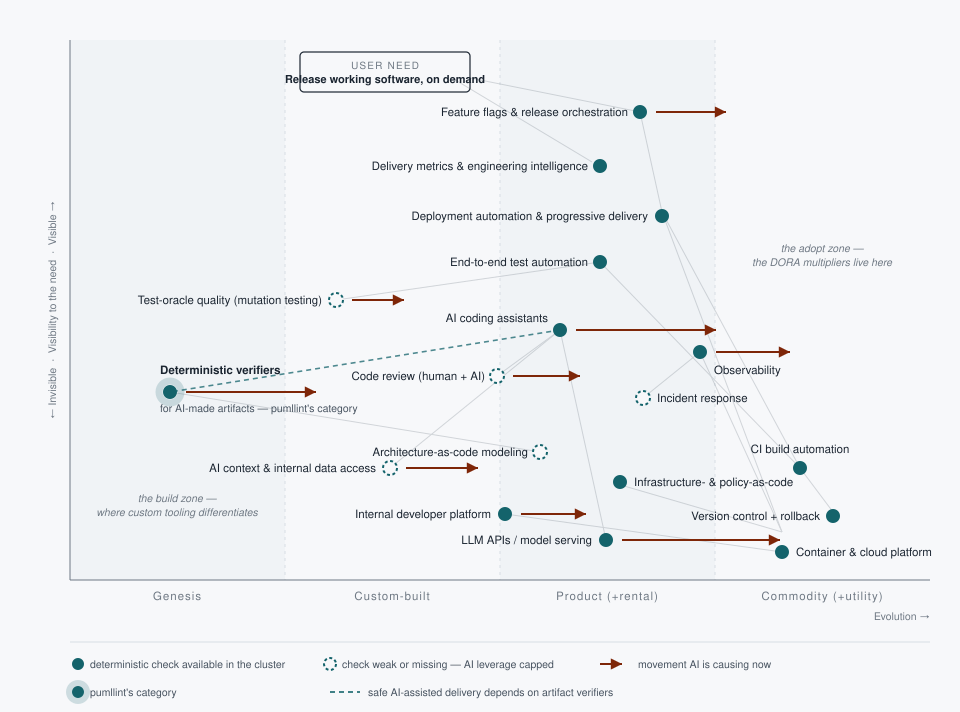

# Where tooling pays: lead time, quality, and AI in the delivery pipeline

*Audience: IT management and transformation leads. No familiarity with the
tooling is assumed — technical terms are introduced in plain language as
they first appear. This is the landscape-level companion to
[pumllint in the SDLC](value-in-the-sdlc.md): that document maps **one
tool** onto the SAFe Continuous Delivery Pipeline; this one maps the
**whole tooling landscape** onto the same skeleton — which capabilities
have real evidence of shortening lead time and improving quality, what AI
changes about that, and where pumllint's category sits within it.
Produced 2026-07-26 by a fan-out research harness: 5 search angles, 21
sources fetched, 104 claims extracted, 25 adversarially verified by
three-reviewer refutation panels — 24 confirmed 3–0, 1 refuted (reported
in the annex). Revised the same day to make the who-does/who-checks
distinction first-class, and again (rev. 2) to incorporate two DORA
primary documents read directly from the PDFs: the AI Capabilities Model
(v2025.1) and The ROI of AI-assisted Software Development (v2026.1); and
once more (rev. 3, same day) to add four specification-quality sources,
each verified against its primary: OpenAI's harness-engineering account,
SWE-bench Verified's annotation data, METR's RCT together with its 2026
update, and SpecFix (ASE 2025). A later pass (rev. 4, 2026-07-27)
re-read the harness-engineering account together with the sources it
cites and added two caveats to it — one about what a generated linter
does not come with, one about the artifact class its authors chose. No
new sources, no changed claims.*

**How to read the claims.** Every load-bearing statement carries a tag,
in decreasing order of strength:

- **[research]** — from DORA, Accelerate, or peer-reviewed work; each
  such claim survived a three-reviewer refutation panel checking it
  against the primary source. (This plays the role **[measured]** plays
  in this repository's other documents — measured, but by others.)
- **[practitioner]** — industry consensus and expert judgment, including
  every Wardley position, every named tool, and the who-does/who-checks
  classification below; no outcome study backs those. (Comparable to
  this repository's **[mechanism]**: a stated causal chain, unmeasured.)
- **[vendor]** — a supplier's own claim, unverified.
- **[measured, internal]** — this repository's own controlled
  experiments ([EVIDENCE.md](../EVIDENCE.md)); rigorous, but our
  measurement, not independent literature.

One companion tag has no analog here: the assessment's **[fact]** — a
shipped, verifiable integration — is stronger than [practitioner]
wherever the companion asserts it.

One discipline up front, because the whole report leans on it: DORA's
findings are correlations from large self-reported surveys —
"associated with", never proven causation — and its headline numbers are
year-specific. They are the best outcome evidence this field has; they
are not physics.

Revision 2 note: claims drawn from the two later-arriving primary
documents are primary-sourced [research] but did not pass through the
original refutation panels; they are marked "rev. 2" where they land.

---

## Executive brief: five findings

**1 · The evidence is about capabilities, not products.** The only
sustained research program linking tooling to delivery outcomes — DORA,
Google's roughly decade-long "State of DevOps" study — deliberately
names zero vendors. It ranks *capabilities*: continuous testing,
monitoring and observability, deployment and database automation,
working in small batches, version control. Teams strong in these
outperformed weak ones by extraordinary margins (in the 2018 study: 46×
more frequent deployments, 2,555× faster lead time, 2,604× faster
recovery, 7× fewer failed changes). Buy tools to implement capabilities;
never expect a tool purchase to be the capability. [research]

**2 · AI made generation cheap and delivery less stable.** DORA 2024
found AI adoption improved almost every local measure — documentation,
code quality, review speed — while *delivery* throughput and stability
both got worse. DORA 2025 (≈5,000 respondents) saw throughput turn
positive, but instability persisted, and the report explicitly tested
and rejected the idea that AI-driven speed compensates for it: "this
argument does not hold up." [research]

**3 · The bottleneck has moved downstream of writing code.** DORA's own
explanation is larger change batches that are harder to review, and its
named remedies are small batches, robust testing, and fluent use of
rollback — AI's team-level benefit is measurably contingent on how often
teams use version-control rollback. 90% of practitioners now use AI; 30%
report little or no trust in its output. In this report's terms: the
stability penalty is what *AI does the work, humans check it by hand*
looks like at industry scale — generation accelerated, verification
didn't. [research]

**4 · Checking machinery is the one immature layer.** On a Wardley map —
a strategy chart that positions each capability by how evolved it is,
from genesis (novel, uncertain) to commodity (standardized,
buy-it-anywhere) — nearly everything with strong outcome evidence sits
at product or commodity: version control, CI, deployment automation,
observability, feature flags. The immature band is *deterministic
verification of AI-produced artifacts*: machine checks with exact,
repeatable verdicts for the code, tests, diagrams, and configs that AI
now writes in volume. Peer-reviewed work shows why it matters:
strengthening a weak test oracle cut measured AI-code correctness by up
to 19.3–28.9% — the code didn't change, the checking did.
[research] [practitioner]

**5 · Strategy follows the map.** Adopt commodities (never build them),
buy products but standardize on open interfaces, and reserve building
for the genesis band — where pumllint's category, the deterministic
verifier for AI-read and AI-written artifacts, sits with external demand
signals now corroborating it. Place AI by the check, not the demo: it
belongs where a deterministic check exists, and it is never itself the
gate — three independent evidence lines say an AI's opinion of AI output
is not a substitute for executing or deterministically checking it.
[practitioner] [measured, internal]

---

## Part 1 — What actually moves lead time and quality

Two terms, defined once. **Lead time** is the clock from a code change
being committed to it running in production. **Quality-in-operation** is
whether changes survive contact with production — measured by how often
deployments cause failures and how fast service is restored. DORA's
"four keys" pair them: deployment frequency and change lead time on the
speed side, change failure rate and recovery time on the stability side.
A fifth of the report's scope — *functional* quality (does the software
do what was intended) — is where the AI-era evidence in Part 2 lands.

DORA's capability catalog is the reference answer to "what should we
invest in": roughly thirty named capabilities — technical (continuous
integration, test automation, deployment automation, trunk-based
development), process (working in small batches, streamlined change
approval), and cultural (generative, learning-oriented culture) — each
linked by the research to faster delivery and better organizational
performance. It names no products at all; "empowering teams to choose
their own tools" is itself listed as a capability. [research]

The named capabilities with direct outcome evidence, from the 2018
deep-dive that remains the most-cited: **continuous testing** (test
early, test constantly, on every change), **monitoring and
observability** (instruments that show what production is doing),
**database change management** (schema changes automated and versioned
like code), and **integrating security early** ("shift-left" — security
checks during development, not after). Teams meeting all five essential
characteristics of cloud infrastructure as NIST defines them were 23×
more likely to be elite performers — and only 22% of self-described
"cloud" users actually met them, a warning that adoption theater is
common. All year-specific figures; direction, not constants. [research]

| DORA 2018, elite vs low performers | |
|---|---|
| Deployment frequency | 46× more frequent |
| Lead time for changes | 2,555× faster |
| Time to restore service | 2,604× faster |
| Change failure rate | 7× lower |

The uncomfortable, useful part: these are the boring capabilities. The
multipliers do not come from novel tooling — they come from disciplined
use of things that are now commodities. That asymmetry is what Part 4's
map is for.

## Part 2 — What AI changes, and what it doesn't buy back

**2024: the paradox.** DORA's 2024 report measured what a 25% increase
in AI adoption was associated with. Nearly everything local improved.
Delivery got worse on both axes. [research]

| Per 25% increase in AI adoption (DORA 2024) | |
|---|---|
| Documentation quality | +7.5% |
| Code quality | +3.4% |
| Code review speed | +3.1% |
| **Delivery throughput** | **−1.5%** |
| **Delivery stability** | **−7.2%** |

DORA's own summary: "improving the development process does not
automatically improve software delivery."

**2025: the update that must always travel with the 2024 numbers.** The
2025 report — ~5,000 technology professionals surveyed, 100+ hours of
qualitative data; still the latest edition as of this writing — found
the throughput association had turned *positive*. The stability penalty
persisted. The report's explanation: "teams are adapting for speed,
[but] their underlying systems have not yet evolved to safely manage
AI-accelerated development," naming the missing piece as "robust control
systems, like strong automated testing, mature version control
practices, and fast feedback loops." [research]

**Speed does not purchase stability back.** DORA 2025 explicitly tested
the argument that AI-accelerated throughput compensates for instability,
and rejected it: no moderating effect was found, and instability "still
has significant detrimental effects on crucial outcomes like product
performance and burnout … which can ultimately negate any perceived
gains in throughput." (A null result in survey data is "no evidence of,"
not proof of absence.) [research]

**The mechanism DORA names sits downstream of generation.** Three
verified pieces: (a) 2024 — AI makes it "possible, even likely, that
changelists are growing in size," and larger changes are consistently
slower and less stable (DORA's stated hypothesis, not demonstrated
causation); (b) 2025 — instability rises "in part, because it is harder
to review larger batches of code"; (c) 2025 — AI's positive effect on
*team* performance is contingent on frequent use of version-control
rollback: at very low rollback use the benefit is statistically
unsupported, at high use it is a medium increase. Rollback is a
deterministic recovery mechanism — a button whose behavior is exact and
repeatable. [research]

**The trust gap sizes the verification demand.** 90% of 2025
respondents use AI at work (up ~14 points year over year); more than 80%
report productivity gains; 30% report little or no trust in AI-generated
code (23% "a little", 7% "not at all", 46% "somewhat"). DORA reads this
as a need for "critical validation skills." Honest direction note:
distrust *shrank* from 39% — the demand comes from volume at
near-universal adoption plus residual distrust, not rising panic.
[research]

### Revision 2 — what the two new primary documents add

**The AI Capabilities Model, enumerated at last.** The model this
report previously refused to enumerate (after a refuted claim — see
annex) contains **seven** capabilities, under one organizing frame:
"AI's primary role in software development is to amplify. It magnifies
the strengths of high-performing organizations and the dysfunctions of
struggling ones." The seven, each with what it measurably amplifies
when paired with AI adoption: *clear and communicated AI stance*
(individual effectiveness, organizational performance, throughput;
reduces friction); *healthy data ecosystems* (organizational
performance); *AI-accessible internal data* (individual effectiveness,
code quality); *strong version control practices* (frequent commits →
individual effectiveness; rollback fluency → team performance);
*working in small batches* (product performance, less friction — at a
slight cost to perceived individual effectiveness, which DORA argues is
the right trade); *user-centric focus* (team performance — and without
it, AI adoption *can harm* teams); *quality internal platforms*
(organizational performance). One honest limit: none of the seven is
shown moderating the delivery-*instability* penalty itself — small
batches is argued as the countermeasure ("can help prevent
AI-accelerated development from leading to increased instability"), but
its measured moderation is on product performance and friction.
[research, rev. 2]

**DORA has named the thesis: "the verification tax."** The 2026 ROI
report models AI value realization as a J-Curve whose dip has three
named phases — the learning curve, *the verification tax*, and pipeline
adaptation. The definition: developers "invest time reviewing generated
code due to concerns about the trustworthiness of output and
hallucinations," multiplied by sheer volume of output. The cost model
makes the tax a direct throughput constraint: "the higher the
verification tax, the fewer annual software deployments will be
possible. Similarly, the lead time for changes will increase because of
this heightened verification burden" — and, flatly: "the most immediate
barrier to ROI is the verification tax." Friction does not vanish under
AI; "the friction moves … replaced by a verification tax — the
cognitive load required to iterate on prompts and rigorously audit
AI-generated code that looks remarkably similar to correct code." That
last clause is the plausibility problem this report's oracle evidence
measures. [research, rev. 2]

**And prescribed the remedy this report argued for.** The ROI report's
five systemic keys of adoption are "trust, platform, data, users, and
guardrails" — where guardrails means "shifting from manual checkpoints
to automated nonoptional security and quality gates … By automating the
verification of AI-generated commits, teams ensure that the increased
throughput enabled by the agentic era results in high-quality product,
not a higher volume of incidents." Named mitigations for the
verification tax include "nonoptional checkpoints and pre-commit hooks
paired with static analysis," heavy investment in automated testing,
and better context for the AI to improve initial output quality. The
capabilities model adds that the developer's work "shifts from writing
code to decomposing, prompting, and verifying," and that 21% of
practitioners already store AI prompts in version control. On the
market divide, the ROI report cites 78% of executives reporting return
on at least one gen-AI use case and 88% of agentic early adopters
seeing returns — figures from Google Cloud's own commissioned research,
so treat them as [vendor]-adjacent — against MIT's "shadow AI" findings
and Stanford's flat measured productivity. [research, rev. 2]

### Revision 3 — the specification-quality stream, from outside

Four sources approached this report's question from the other side —
not "are the checks strong enough?" but "are the *inputs* specified
well enough?". Each was verified against its primary source for this
revision; none passed through the original refutation panels. Together
they are the external case for the fourth rule below, *check inputs,
not just outputs*.

**The vendor precedent at scale.** OpenAI's "Harness engineering"
account (2026-02-11) describes building an internal beta product of
roughly one million lines of code across ~1,500 pull requests in five
months — by its own telling with zero lines written by hand, by a team
of three growing to seven whose job was "designing the environment
that made reliable code generation possible." The load-bearing
mechanisms it names are this report's safe insertion pattern, stated
from the producer side: a structured in-repo documentation directory
of system maps, execution plans and design specifications for the
agents to read, and architectural constraints that "were not advisory.
They were enforced mechanically via custom linters — themselves
generated by Codex," with lint errors carrying fix instructions back
into the agent's context. Its premise is the context problem in one
sentence: anything the agent "cannot access in-context effectively
does not exist" — knowledge in chat threads, shared documents, or
someone's head is invisible to the system. One team's self-report, no
control condition — but the largest published agent-first build to
date made mechanically-checked in-repo artifacts the control layer.
One further detail belongs on the record because it cuts against this
report's own preference: the system of record described is markdown,
code and generated schema documentation, and the account names no
hand-authored models anywhere in the tree. Read honestly, that makes it
corroboration for the *mechanism* — mechanically-checked in-repo
artifacts — and a caution about the *artifact class*: at this team's
scale the designs were written, not drawn. [vendor, rev. 3]

**Spec ambiguity has a measured base rate.** SWE-bench — the standard
benchmark where an AI must resolve real GitHub issues — was audited by
OpenAI in August 2024 to produce SWE-bench Verified: 93 experienced
developers screened 1,699 tasks, grading each issue description on a
0–3 severity scale for being underspecified (and a parallel scale for
whether the validating tests are fair). 38.3% of real issue
descriptions were flagged underspecified; filtering on both scales
discarded 68.3% of the benchmark. Two readings: over a third of
real-world change requests were too ambiguous to fairly judge a
solution against — and the grading had to be done by paid human
annotators, because no deterministic spec-quality check exists. That
is the Synthesize oracle gap of Part 3, measured and hand-filled at
benchmark scale. [vendor, rev. 3]

**The independent skeptic — always cited with its update.** METR, an
independent AI-evaluation nonprofit, ran the field's only rigorous
randomized controlled trial (each task randomly assigned AI-allowed or
AI-forbidden, so the comparison is like-for-like): 16 experienced
maintainers, 246 real issues in their own mature repositories
(1M+ lines, ~5 years of own contributions on average), early-2025
tools. With AI the developers took 19% *longer* — after forecasting a
24% speedup, and still believing in a 20% speedup afterwards. METR's
factor analysis names five likely contributors; the load-bearing one
here is the developers' implicit knowledge of their own repositories —
context the AI never saw because nothing forced it to be explicit.
That is the strongest independent argument that tacit context is a
real tax, and explicit, machine-checkable context is the
countermeasure. The mandatory companion (the same travel-together rule
as DORA 2024/2025): METR banners the result as out of date; its
February 2026 continuation on late-2025 tools measured point estimates
of 18% (original cohort) and 4% (new cohort) slower, both with
intervals spanning zero, and disclosed a selection effect biasing all
its estimates downward — developers increasingly refuse to work
without AI, and withheld the tasks AI helps most with. METR's own
words: the new data is "only very weak evidence," and the true speedup
is likely higher. What survives as durable content is the
perception gap and the factor analysis; the 19% headline is a 2025
artifact, not a constant. [research, rev. 3]

**The academic proof-of-concept for repairing inputs.** SpecFix
(ASE 2025, peer-reviewed) repairs ambiguous programming-problem
descriptions automatically: it surfaces ambiguity by sampling the
different programs a description induces and testing where their
behaviours diverge, then rewrites the description until the divergence
disappears. Across four models and three benchmarks it modified 43.58%
of descriptions; on those, Pass@1 — the share of problems solved on
the first attempt, judged by *executing* tests — rose 30.9%, a 4.09%
absolute gain across the full benchmarks, and repairs made against one
model transferred to others (+10.48%). Scope honestly stated:
function-level benchmark descriptions, not real-world specs or
diagrams. It is the external, code-level cousin of this repository's
input-cliff result below: repairing the input measurably raises
executed correctness. [research, rev. 3]

One converging pattern, softened from how it is often stated: not
"every vendor," but the two with citable model-specific guidance both
say it. OpenAI's GPT-5 prompting guide warns that contradictory or
vague instructions damage its more literal instruction-follower *more*
than earlier models (it spends reasoning effort trying to reconcile
the conflict); Anthropic's Claude 4 guidance leads with the same
advice from the same cause — precise instruction-followers reward
explicit, conflict-free specification. Direction: as generation gets
more precise, ambiguous or contradictory inputs get more expensive,
not less. [vendor, rev. 3]

### The oracle evidence

An **oracle**, in testing, is whatever decides "correct or not." A
**deterministic** oracle — a compiler, a test suite, a linter, a schema
check — gives the same exact verdict every time. The question AI forces
is whether our oracles are strong enough to carry the volume.

- **Weak oracles overstate AI correctness — by a measured amount.** When
  the standard AI-coding benchmark HumanEval had its test suite expanded
  80-fold (HumanEval+, NeurIPS 2023), the measured pass rates of 26
  popular models — GPT-4 included — dropped by up to 19.3–28.9%
  (worst-case relative reductions across settings). Same code, stronger
  checking, different verdict. [research]
- **The oracle problem predates AI.** The canonical software-engineering
  survey (Barr et al., IEEE TSE 2015) identified the lack of automated
  oracles — not test *generation* — as the binding bottleneck on test
  automation. AI industrialized generation on both sides; the bottleneck
  stayed put. [research] (fetched and cited; not put through this
  report's refutation panel)
- **AI judging AI is not a check.** Recent benchmark studies find LLM
  code judges exhibit significant randomness and systematically
  hallucinate defects that are not there. This repository's experiments
  agree from the other direction: across 500+ generation runs, an AI
  judge's score of generated code tracked the code's *executed* test
  results at r ≈ 0.25 within one vendor and r ≈ 0.002 across vendors —
  while two AI judges agreed with each other at r ≈ 0.7. Two judges
  agreeing is reliability, not validity. [research] [measured, internal]
- **Input quality has a cliff, and only a deterministic gate catches
  it.** This repository's execution-tested evidence: architecture
  diagrams below maturity Level 2 produced code failing roughly one
  intended behavior in three when run, versus about one in ten above — a
  ~21-point gap that held across three generators from two vendors, and
  that better prompting never rescued. [measured, internal]
  ([EVIDENCE.md](../EVIDENCE.md))

### The thesis, tested

> *"As AI makes generation cheap, deterministic verification becomes the
> binding constraint on both lead time and quality."*

**Verdict (revised): supported, and now largely stated by DORA itself —
still not causally proven.** At first publication this framing was the
report's own inference; DORA's words were "robust testing, small
batches, critical validation skills." The 2026 ROI report closes most
of that attribution gap: it names *the verification tax*, models it as
the direct suppressor of deployment frequency and lead time for
changes, calls it "the most immediate barrier to ROI," and prescribes
automated, nonoptional verification gates as the remedy. What remains
this report's own sharpening is one word — *deterministic* — as the
property those gates need (DORA's "automated nonoptional" is
functionally the same demand), plus the standing caveat: all of this
rests on correlational survey research and guidance essays, not causal
measurement. The direct test — does the instability penalty shrink
where verification capability is strong — remains unpublished. Rev. 3
adds four external streams that land consistent with the framing on
the input side — vendor practice at 1M-line scale, a measured 38.3%
spec-ambiguity base rate, an RCT slowdown whose named factors include
implicit context, and peer-reviewed input repair raising executed pass
rates — and none of them is causal proof either.

## Part 3 — The sixteen activities, mapped

SAFe — the Scaled Agile Framework, the enterprise delivery playbook this
report uses as its skeleton — describes a **Continuous Delivery
Pipeline** with four aspects, each containing four activities. SAFe's
public pages verify the four aspects and the activity names of the
middle two aspects; the Continuous Exploration and Release on Demand
activity names sit behind its login wall and rest on secondary sources
(marked *). SAFe's definition makes automation constitutive of the
pipeline — "the workflows, activities, and automation needed to guide
new functionality from ideation to an on-demand release of value" —
which is what licenses mapping tooling onto activities at all.
[research]

### Who does the work, who checks it

Before the grid, its organizing distinction. For every activity, ask two
separate questions: who *does* the work, and who *checks* it — with
three possible actors for each: a **human**, an **AI**, or
**deterministic automation** (a machine step whose behavior is exact and
repeatable). Familiar setups are cells of that grid, not categories of
their own:

| Work done by | Checked by | Example | Reading |
|---|---|---|---|
| Human | Human | Design review, incident command | Where judgment is the activity |
| Human | Deterministic | A hypothesis behind a pre-registered A/B test | Instrumented judgment |
| AI | Human | AI-written code, manually reviewed | The configuration behind DORA's stability penalty: generation accelerated, review capacity didn't |
| AI | Deterministic | AI code behind compiler/tests/linters; AI-written infrastructure config behind plan-diff + policy checks | The safe insertion pattern |
| Deterministic | Deterministic | Build, deploy, guarded rollout | What commodity means |

The mode is not a fixed property — it follows Wardley evolution. Genesis
work is done by humans because novelty demands judgment; as a capability
evolves, AI becomes usable; at commodity the work runs as deterministic
automation end to end. AI is the *transitional actor* between artisan
and automation — which is Simon Wardley's own reading of "conversational
programming". [practitioner]

That gives "human-only" two very different meanings, with opposite
strategies. An activity can be human-only *for now* — because AI there
is still genesis, or because the deterministic check that would make AI
safe doesn't exist yet (watch it; this is the build list). Or it can be
human-only *durably* — because the judgment is intrinsic to the
activity: whether a design is right, what a metric means, what the
organization should learn (protect it; don't wait for AI to absorb it).
The grid marks which is which. And one rule from Part 2's evidence
carries throughout: AI belongs on the *does* side; on the *checks* side
it is triage at most, never the gate. The classification itself is the
author's analysis. [practitioner]

Column guide for the grid: capability cluster with representative tools
(instances, not endorsements — all tool naming is [practitioner]),
Wardley evolution stage (→ marks AI-driven movement), then who does and
who checks today. Depth is deliberately uneven: Develop, Build, Test
End-to-End, Deploy, Monitor, and Release get full treatment;
practice-heavy activities are covered briefly and say so.

### Continuous Exploration — where intent is formed *(names per secondary sources)*

| Activity | Capability cluster · representative tools | Evolution | Who does the work today | Who checks it today |
|---|---|---|---|---|
| Hypothesize* | Experimentation & product analytics — Amplitude, Statsig, LaunchDarkly Experimentation. Practice-heavy; covered briefly. | Product | **Human, durably** — choosing what to bet on is a value judgment; AI drafts hypotheses and result summaries (genesis→custom) | **Deterministic by design** — a pre-registered experiment is the oracle for a value hypothesis (statistical, not exact) |
| Collaborate & Research* | Collaborative design & research repositories — Figma/FigJam, Miro, Dovetail. Practice-heavy; covered briefly. | Product → commodity | **Human** — AI synthesis of research and meetings assists (custom→product) | **Human, durably** — no oracle for "did we understand the users"; real validation belongs to Hypothesize's experiments |
| Architect* | Architecture-as-code modeling — PlantUML, Mermaid, Structurizr; conformance checks — ArchUnit; **diagram verifiers — pumllint** | Modeling: product · verifiers: genesis → custom | **Human design; AI drafts** — diagrams and decision records now generated at near-zero cost, volume with no quality control attached | **Split** — hygiene, consistency, maturity: deterministic (pumllint [measured, internal]); design *semantics*: human, durably. The split is the category's scope guard |
| Synthesize* | Backlog & program tooling — Jira, Azure Boards, Jira Align | Commodity | **Human prioritization; AI drafts** stories and grooming (custom→product) | **Human, for now** — no linter for the *stories themselves* exists yet; the model-side half of the traceability link is already checkable (convention-gated requirement/ADR-link and owner-tag rules). The story-side check is the named oracle gap (Part 5), so AI-drafted stories are hand-checked or unchecked |

### Continuous Integration — where the checks run *(names page-verified)*

| Activity | Capability cluster · representative tools | Evolution | Who does the work today | Who checks it today |
|---|---|---|---|---|
| Develop | Version control — git, GitHub, GitLab; AI coding assistants — GitHub Copilot, Claude Code, Cursor; static analysis — ESLint, ruff, SonarQube; code review incl. AI reviewers | VCS, linters: commodity · assistants: product → commodity · AI review: custom → product | **AI + human pair** — the largest AI surface in the SDLC; DORA: +3.4% code quality, +3.1% review speed per 25% adoption, against the delivery-stability penalty [research] | **Deterministic first, human residue** — compiler, types, linters, unit tests carry the volume; human review carries what they can't; AI review triages but must not gate. Densest oracle stack in the pipeline — why AI landed here first. Rollback fluency is the DORA-evidenced recovery condition [research]. DORA 2026's name for this checking burden: "the verification tax" (rev. 2) |
| Build | CI build automation — GitHub Actions, GitLab CI, Jenkins; build systems — Gradle, Bazel; supply-chain integrity — Sigstore, SLSA, SBOM tooling | CI: commodity · build systems: product · supply chain: custom → product | **Deterministic** — automation is the activity; AI assists pipeline authoring and failure triage | **Deterministic by construction** — compile, resolve, sign, attest; binary verdicts. DORA capability: continuous integration [research] |
| Test End-to-End | Test automation — Playwright, Cypress; contract testing — Pact; **test-oracle quality** — mutation testing: Stryker, mutmut. DORA 2018: continuous testing crucial [research] | Automation: product · oracle-quality: custom, thin adoption → | **Human + AI author; deterministic executes** — AI test generation moving custom→product fast; "self-healing" tests [vendor] | **The suite checks the product; humans check the suite — for now.** The deterministic check-of-the-check exists (mutation testing) but adoption is thin; HumanEval+ measured what weak suites hide: up to 19.3–28.9% overstated correctness [research]. When AI writes the tests too, this gap is the risk |
| Stage | Infrastructure-as-code — Terraform/OpenTofu, Pulumi; policy-as-code — OPA, Checkov; ephemeral environments; containers — Kubernetes | IaC: product → commodity · policy: product · containers: commodity | **AI increasingly writes; deterministic applies** — infrastructure config is a text artifact AI generates well | **Deterministic** — plan diffs and policy engines give exact verdicts before production. The model configuration: AI does, machine checks |

### Continuous Deployment — to production, safely *(names page-verified)*

| Activity | Capability cluster · representative tools | Evolution | Who does the work today | Who checks it today |
|---|---|---|---|---|
| Deploy | Deployment automation — Argo CD, Spinnaker, Octopus; progressive delivery — Argo Rollouts, Flagger; database change management — Liquibase, Flyway — both DORA-named capabilities [research] | Product; mechanics commoditizing | **Deterministic** — humans on exception only; AI risk scoring exists [vendor] | **Deterministic** — health checks, canary thresholds, automated rollback triggers |
| Verify | Post-deployment verification — smoke suites, synthetic probes (Checkly), canary analysis (Kayenta), chaos engineering (Gremlin, LitmusChaos) | Custom → product | **Deterministic** — probes, smoke runs, injected failures on schedule | **Deterministic** — service-level objectives (SLOs: explicit numeric reliability targets) turn "is it healthy?" into arithmetic; AI anomaly detection assists, never gates alone |
| Monitor | Observability — Prometheus/Grafana, Datadog, OpenTelemetry. DORA 2018: monitoring & observability crucial [research] | Product → commodity (OpenTelemetry standardization) | **Deterministic collection; AI summarizes** — AIOps anomaly detection and incident summaries (custom→product) | **Deterministic rules, human interpretation** — alert thresholds and SLO math are exact; deciding what the picture *means* stays human, durably |
| Respond | Incident management — PagerDuty, incident.io; rollback/revert mechanics (the deterministic recovery lever DORA ties AI's benefit to [research]) | Product → commodity | **Human command, durably** — AI drafts summaries and suggests causes; rollback executes deterministically | **Split** — recovery is deterministically checkable (service restored per SLO); root-cause *correctness* has no oracle, so AI root-cause analysis stays a suggestion, checked by humans |

### Release on Demand — value, governed *(names per secondary sources)*

| Activity | Capability cluster · representative tools | Evolution | Who does the work today | Who checks it today |
|---|---|---|---|---|
| Release* | Feature flags & release orchestration — LaunchDarkly, Unleash, Split; OpenFeature standard. SAFe verified: deployment and release are decoupled [research]; flags as the standard instantiation is [practitioner] | Product → commodity (OpenFeature) | **Human decision, deterministic mechanics** — releasing is a business call, durably human; flags execute it exactly and reversibly. AI writes the release notes | **Deterministic** — guarded rollout rules and flag-gated exposure make "who sees this" checkable and revocable |
| Stabilize* | SRE practice tooling — error budgets, SLO platforms (Nobl9), resilience/DR testing. Covered briefly. | Custom → product | **Human practice; deterministic tracking** — AI drafts runbooks, summarizes toil | **Deterministic** — error-budget arithmetic is exact once SLOs are set |
| Measure* | Engineering intelligence & value-stream management — DX, LinearB, Faros, Plandek | Product | **Deterministic instruments** — AI narrates insights [vendor] | **Human, durably** — deciding what the numbers mean, and spotting metric gaming (Goodhart), is judgment; these instruments are themselves the pipeline's oracle, with survey-vs-telemetry divergence the known caveat |
| Learn* | Retrospective & postmortem practice; tooling deliberately thin. DORA: generative culture is a measured capability [research]. Practice-heavy; covered briefly. | Practice, not product | **Human, durably** — organizational learning is not delegable; AI drafts postmortems | **None by machine** — whether the organization actually learned is unverifiable |

## Part 4 — The Wardley map

How to read it, in one paragraph. The vertical axis is **visibility**:
how close a component sits to the anchoring user need at the top — here,
*release valuable, working software on demand*. The horizontal axis is
**evolution**: how far the capability has traveled from genesis (novel,
uncertain, hand-built) through custom-built and product toward commodity
(standardized, rented, undifferentiated). Position is a property of the
capability in the market, never a score for a vendor. Arrows show
movement AI is causing now. Every position is expert judgment —
[practitioner] — informed by the verified evidence in Parts 1–2.

Three things the map says at a glance. First, **everything with strong
outcome evidence is on the right** — the capabilities DORA's multipliers
reward are products and commodities; there is no glory in building them,
only in adopting them well. Second, **AI is pulling the middle rightward
fast**: coding assistants, LLM APIs, observability, feature flags are
all commoditizing (Simon Wardley's own reading is that hand-written
coding itself is commoditizing under "conversational programming" —
[practitioner]). Third, **the left side is nearly empty except for
verification**: the one genuinely immature layer is deterministic
checking for the artifacts AI now mass-produces — and the dashed nodes
(code review, architecture modeling, test-oracle quality, root-cause
analysis) mark exactly the places where, in the grid's terms, checking
is still human-only — or, for architecture modeling, where the
deterministic check exists but the category delivering it is still
genesis: the dashed node depends on the highlighted one.

Revision 2 added two components straight from the new primary
documents. **AI context & internal data access** (custom-built, moving
right) is the capabilities model's context layer — AI-accessible
internal data, healthy data ecosystems, and the ROI roadmap's first
capital investment: documentation that is "high fidelity and machine
readable." It is drawn dashed deliberately: the context the agents feed
on has no strong verifier of its own, which makes it both the newest
dependency of safe AI-assisted delivery and another face of the
check-inputs problem. **Internal developer platform** (custom-built
edge, productizing) is the model's "quality internal platforms"
capability — in the ROI report's words, "the risk mitigator and the
context provider for AI agents." It is drawn filled: a platform's
guardrails are exactly the automated, nonoptional gates DORA
prescribes. [research, rev. 2] [practitioner]

## Part 5 — Strategic read

**Commodity — adopt, never build, measure the discipline.** Version
control (with rollback fluency — the specific practice DORA ties AI's
team benefit to), CI build, container/cloud platform, mainstream
linters, feature flags as they standardize on OpenFeature. The oldest,
strongest evidence lives here, and differentiation is impossible by
construction. The only investment that pays is adoption depth: the 2018
finding that only 22% of "cloud" users met the essential characteristics
is the standing warning. [research]

**Product — buy, integrate, standardize on open interfaces.** Deployment
automation, progressive delivery, end-to-end test platforms,
observability (insist on OpenTelemetry), engineering intelligence,
incident management. Tool choice among credible products is rarely the
differentiator — practice is. Prefer open interfaces so commoditization
works for you, not against you. [practitioner]

**Genesis / custom-built — the only zone where building
differentiates.** Deterministic verifiers for AI-read and AI-written
artifacts; oracle-quality tooling (mutation testing for AI-generated
test suites); policy-as-code for artifact types that never had checks.
The demand signals are external now: DORA 2025 names missing "robust
control systems" as why AI speed converts to instability; 30% of
practitioners don't trust AI output; HumanEval+ quantifies what weak
checking hides. This is where pumllint already sits.
[research] [practitioner] Rev. 2: DORA's 2026 ROI report turns these
signals into doctrine — "guardrails" is one of its five systemic keys
of adoption, the verification tax is "the most immediate barrier to
ROI," and the named mitigations (nonoptional checkpoints, pre-commit
hooks paired with static analysis, heavy automated testing) are
literally this category's shipping forms. [research, rev. 2] Rev. 3
adds the vendor-side existence proof: OpenAI's own agent-first build
at ~1M-line scale names custom linters and structural tests — not
documentation, not review — as the load-bearing control layer, and had
the agents generate those linters themselves. [vendor, rev. 3] Read
straight, that existence proof cuts both ways, and this report should
say so: if agents can generate the rule code, the scarce ingredient in
this category is not the rules but what makes a check trustworthy —
calibration against a frozen scale, an evidence base tying the checks
to outcomes, and scores comparable across teams. None of those come
free with a generated linter; that reading is this report's inference,
not OpenAI's claim.

### Rules for the AI-heavy pipeline

- **Gate AI-produced work on deterministic checks, not AI opinion.**
  Compilers, tests, linters, plan diffs, policy engines — verdicts that
  are exact and repeatable. Three independent evidence lines (judge
  randomness and defect-hallucination studies; this repository's
  judged-vs-executed r ≈ 0.25 / 0.002) say an AI judging AI output is
  reliability theater: judges agree with each other more than any of
  them agrees with reality. [research] [measured, internal]
- **Place AI by the check, not the demo.** Where checking is
  deterministic (Develop, Stage, test execution), AI can do the work
  safely today. Where checking is durably human (design semantics,
  incident command, interpreting metrics, learning), buy assistance,
  never autonomy. Where checking is human-only just because an oracle is
  missing — acceptance criteria, test-assertion strength, diagram
  semantics — that is the build list: Part 4's dashed nodes.
  [practitioner]
- **Keep batches small and rollback fluent** — DORA's two named,
  evidenced countermeasures to the AI stability penalty. [research]
- **Check inputs, not just outputs.** The one measured input-side
  result: diagram maturity below a machine-checkable threshold cost ~21
  points of executed correctness in generated code, and no prompt
  engineering rescued it. Where AI reads an artifact as specification,
  lint the artifact first. [measured, internal]

### pumllint, positioned

The category — deterministic verifiers for AI-made artifacts — sits at
genesis moving into custom-built, serving Architect, Develop, and
Build: the three activities where the companion assessment claims
*direct* action (rules act in Architect; hooks, CLI and auto-fix run in
Develop; the Action, gates and Sonar export run in Build) — with four
more supported (Collaborate & Research, Synthesize, Measure, Learn)
and, deliberately, no claim at all in five (per-activity detail:
[pumllint in the SDLC](value-in-the-sdlc.md)). The grid above names
market-representative tools only; this repository's tool is named
solely where its artifact class lives. That placement is correct: the
map's only under-built layer, with corroborating external demand
signals, and its internal evidence (the below-Level-2 cliff; execution
beats judgment) is the micro-scale version of what DORA measures at
industry scale. The [roadmap's](../ROADMAP.md) demand-driven stance is
right. The adjacent oracle gaps worth watching for pull, nearest asset
first:

- **Diagram↔code conformance** — does the implementation still match
  the model? Bridges Architect to Develop; pumllint's parsed model is
  the natural asset. [practitioner]
- **Oracle quality for AI-generated tests** — assertion strength and
  mutation coverage as a gate; the strongest external evidence base of
  the four (HumanEval+). [research]
- **Spec and acceptance-criteria linting** — the Synthesize activity's
  missing check, upstream of everything AI generates from stories.
  Rev. 3 turned this from judgment into an evidenced gap: OpenAI paid
  93 annotators to hand-grade issue underspecification because no
  machine check exists (38.3% of real issues flagged), and SpecFix
  shows automated ambiguity repair measurably raises executed pass
  rates. [practitioner] [research, rev. 3] [vendor, rev. 3]
- **Prompt/agent-configuration linting** — a new artifact class with no
  checks at all; earliest-stage, least defined. Rev. 2 upgraded this
  signal: DORA finds 21% of practitioners already store AI prompts in
  version control — the artifact class is forming in repositories now.
  [research, rev. 2] [practitioner]
- **AI-context and documentation quality checks** (new in rev. 2) — the
  ROI roadmap's first capital investment is a context layer whose
  stated goal is documentation that is "high fidelity and machine
  readable," because a fragmented knowledge graph makes AI "generate
  bloat." Machine-checkable context quality is an oracle gap the whole
  agentic stack sits on — and this repository's model-set-as-AI-context
  hypothesis is one instance of it. [research, rev. 2] [practitioner]
  The harness-engineering account is this gap's vendor precedent:
  agent-legible in-repo docs whose cross-links and architectural
  constraints are verified by linters, at ~1M-line scale.
  [vendor, rev. 3]

### What would change this picture

Two of the four items listed at first publication resolved the same
day, when the primary documents arrived: the AI capabilities model's
contents (now enumerated in Part 2) and a 2026 DORA publication (the
ROI report — guidance built on the 2025 survey, not a new survey).
Still open:

- DORA showing the AI-instability association shrinking where test
  automation and small batches are strong — the direct test of this
  report's thesis. The capabilities model moderates value outcomes
  (performance, quality, friction), not the instability penalty itself;
  the test remains unpublished.
- Outcome-grade evidence for oracle strength on non-code artifacts —
  diagrams, IaC, specs — beyond this repository's internal results;
  today that evidence base is one project deep.
- A 2026 State of AI-assisted Software Development survey edition —
  new measured effects rather than guidance.
- METR's redesigned productivity experiments (announced February 2026
  after its selection-effect disclosure: developer-level
  randomization, fixed tasks, observational telemetry) publishing
  current-generation causal estimates — the independent successor to
  the now-historical 19% result.

---

## Annex — evidence discipline

**The claim that failed verification.** "DORA has added a dedicated AI
capability category listing six capabilities…" — refuted 0–3. An
AI-related capability grouping does exist on dora.dev, and verifier
notes reference a seven-capability 2025 AI Capabilities Model, but the
six-member enumeration did not survive checking against the source. At
first publication this report therefore cited the model's existence and
refused to list its members.

*Resolution (rev. 2):* the primary PDF confirms the refutation was
correct. The model has seven members, not six; the refuted list was
missing *working in small batches* and misnamed two others (the model
says *quality internal platforms*, not "platform engineering", and
*strong version control practices*, not "version control" — though
DORA's own capability-page URL for platforms is still
/platform-engineering). The enumeration now in Part 2 comes from the
primary document.

**Standing caveats.**

- All DORA evidence is correlational, self-reported survey research;
  "associated with," never proven causation. Survey-vs-telemetry
  divergence is a known critique.
- Headline multipliers are year-specific (2018's 46×/2,555× swung to
  208×/106× in 2019); use them as illustrations of capability
  separation, not constants.
- The 2024 AI findings must always travel with the 2025 update
  (throughput flipped positive; the stability penalty is what held).
- Eight of the sixteen SAFe activity names (Continuous Exploration and
  Release on Demand) rest on secondary sources — the primary articles
  are login-gated; the four aspects and the CI/CD activity names are
  page-verified.
- Wardley positions and all named tools are practitioner judgment. The
  who-does/who-checks classification per activity is likewise the
  author's analysis — consistent with, but not asserted by, the cited
  research. This repository's numbers are internal measurements,
  consistent with but not part of the externally verified set.
- Rev. 2 additions from the AI Capabilities Model (v2025.1) and the ROI
  report (v2026.1) were read directly from the primary PDFs and did not
  pass through the original three-reviewer refutation panels. The ROI
  report's market-divide figures (78% / 88%) come from Google Cloud's
  own commissioned research — vendor-adjacent despite appearing in a
  DORA publication. The ROI report is guidance built on the 2025
  survey; it adds no new measured survey effects.
- Rev. 3's four streams were likewise verified against their primary
  sources but not panel-refuted. Their specific caveats: METR's 19%
  slowdown must always travel with its February 2026 update (the
  authors banner it out of date, the continuation's intervals span
  zero, and a disclosed selection effect biases all its estimates
  downward — METR is an independent nonprofit but the paper is an
  arXiv preprint, not peer-reviewed). The harness-engineering account
  is one team's self-report with no control condition — [vendor]
  discipline applies however well it fits this report's thesis.
  SWE-bench Verified's 38.3% is OpenAI-published annotation data;
  reading it as a spec-ambiguity base rate is this report's
  interpretation. SpecFix's headline 30.9% is on the 43.58% of
  descriptions it modified — 4.09% absolute across full benchmarks, on
  function-level descriptions, not real-world specs or diagrams. And
  the oft-repeated "every vendor now says ambiguity is more damaging"
  is stated here only for the two vendors with citable guidance
  (OpenAI, Anthropic).

**Principal sources.**

- *Primary:* dora.dev — capability catalog, 2018 report, 2024 report +
  PDF, 2025 report + PDF ("State of AI-assisted Software Development");
  DORA AI Capabilities Model (v2025.1) and The ROI of AI-assisted
  Software Development (v2026.1) — primary PDFs, read directly
  (rev. 2); framework.scaledagile.com — Continuous Delivery Pipeline,
  Continuous Integration, Continuous Deployment; HumanEval+/EvalPlus
  (NeurIPS 2023); Barr et al., "The Oracle Problem in Software Testing"
  (IEEE TSE 2015); LLM-judge reliability studies (arXiv 2025–26).
- *Secondary:* RedMonk, Jellyfish, RDEL close-reads of DORA 2025; SAFe
  6.x practitioner material for the gated activity names.
- *Rev. 3 primaries:* OpenAI — "Harness engineering: leveraging Codex
  in an agent-first world" (2026-02-11) and "Introducing SWE-bench
  Verified" (2024-08); METR — early-2025 RCT (arXiv 2507.09089) and
  the 2026-02-24 experiment-design update (metr.org); SpecFix —
  "Automated Repair of Ambiguous Problem Descriptions for LLM-Based
  Code Generation" (ASE 2025, arXiv 2505.07270); OpenAI GPT-5
  prompting guide; Anthropic Claude 4 prompt-engineering guidance.
- *Strategic lens:* Simon Wardley, "Why the fuss about conversational
  programming?"; practitioner Wardley analyses of the DevOps toolchain.
- *Internal:* [EVIDENCE.md](../EVIDENCE.md) — 500+ generation runs,
  execution-tested, cross-vendor.
